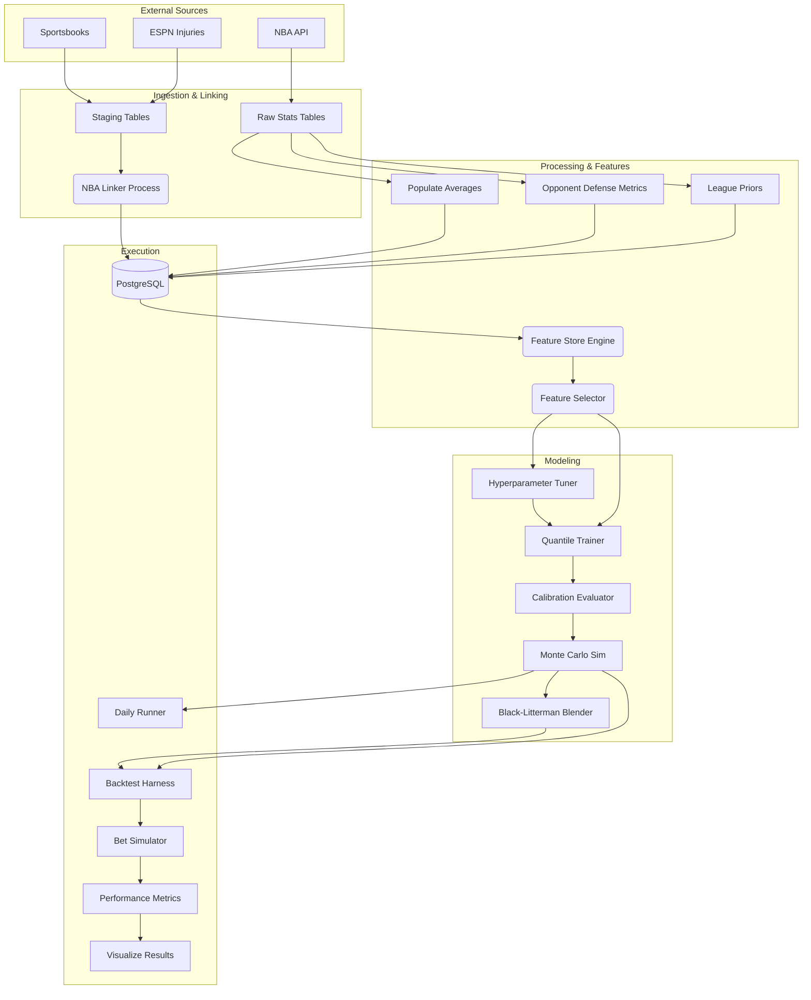

# GameFlowData Architecture

This document describes the system architecture, design patterns, and data flows for **GameFlowData**, an NBA analytics and machine learning platform for player prop betting markets.

---

## High-Level Overview

GameFlowData is a data-intensive application that ingests raw NBA game statistics and sportsbook odds, normalizes and links them, trains advanced machine learning models (Quantile Regression + Monte Carlo), and evaluates performance via a rigorous time-travel backtesting harness.

### Core Goals
1.  **Precision Data:** Accurate, pace-adjusted, and opponent-specific metrics.
2.  **Probabilistic Modeling:** Predicting full probability distributions (not just means) to price derivatives.
3.  **Backtesting Rigor:** Preventing look-ahead bias to realistically simulate betting edges.

---

## Technology Stack

| Layer | Components | Purpose |
|-------|------------|---------|
| **Language** | Python 3.11+ | Core runtime |
| **Database** | PostgreSQL 15+ (Supabase) | Primary relational store |
| **ORM/Data** | SQLAlchemy 2.0, Pandas 3.0, Psycopg2 | Data access and manipulation |
| **ML Core** | XGBoost, Scikit-Learn, NumPy, SciPy | Quantile regression, isotonic calibration, statistics |
| **HPO** | Optuna | Bayesian hyperparameter optimization |
| **API** | FastAPI, Uvicorn, Pydantic | Web framework (future live pipeline) |
| **Data Sources** | nba_api, The Odds API, ESPN | NBA stats, sportsbook odds, injury reports |
| **Pipeline** | Custom Python orchestration | Training, inference, and backfill jobs |
| **Visualization** | Plotly | Backtest equity curves and diagnostic plots |
| **Testing** | Pytest, Pytest-Cov | Unit and integration testing |
| **Linting/Types** | Ruff, Pyright | Code quality and static analysis |

---

## Directory Structure

```
GameFlowData/
├── src/                        # Main source code
│   ├── db/                     # Database connection layer
│   ├── scrapers/               # Data ingestion (13 modules)
│   ├── processing/             # Data pipeline: linking, averages, backfill
│   ├── models/                 # ML core: features, training, inference
│   ├── backtesting/            # Historical replay and bet simulation
│   └── orchestration/          # Daily workflow coordination
├── tests/                      # Unit and integration tests (33 modules)
├── docs/                       # Component-level documentation
├── notebooks/                  # Jupyter notebooks for research
├── database/                   # Schema definitions (schema.sql)
├── data/linker_data/           # Local CSV cache for linking pipeline
├── backtest_results/           # Backtest output and analysis
├── pyproject.toml              # Project config, deps, ruff/pytest settings
├── requirements.txt            # Production ML/data dependencies
├── requirements-dev.txt        # Dev/test dependencies
├── pytest.ini                  # Test runner configuration
└── alembic.ini                 # Database migration configuration
```

---

## System Components

### 1. Database Layer (`src/db/`)

**`client.py`** — Singleton SQLAlchemy engine with connection pooling.
- Pool size 5, max overflow 2, 5-minute connection recycle.
- 5-minute statement timeout.
- pgBouncer compatible.

### 2. Data Collection & "The Linker"

The system ingests data from two distinct worlds that don't natively share identifiers:
1.  **Official NBA Data:** (Via `nba_api`) Game stats, player bios, team box scores.
2.  **Sportsbook Data:** (Via The Odds API) Player props, game lines, futures.
3.  **Injury Data:** (Via ESPN) Player injury reports and status.

#### Scrapers (`src/scrapers/`)

| Module | Purpose |
|--------|---------|
| `nba_unified_scraper.py` | CLI tool for team game stats and player advanced metrics from NBA API |
| `daily_player_props_scraper.py` | Daily player prop lines from Odds API |
| `daily_game_lines_scraper.py` | Daily game spreads and totals |
| `live_odds_scraper.py` | Real-time odds from multiple sportsbooks |
| `espn_injury_scraper.py` | ESPN injury reports and player status |
| `nba_player_position.py` | Player position data |
| `injury_database.py` | Injury data management |
| `injury_scraper_job.py` | Scheduled injury updates |
| `update_league_position_averages.py` | League-wide position average baselines |
| `update_player_position_history.py` | Historical player position tracking |
| `player_prop_scraper.py` | Alternate player props source |
| `game_lines_scraper.py` | Historical game lines |

#### The NBA Linker (`src/processing/nba_linker_local.py`)

Serves as the bridge between NBA and sportsbook data:
- **Fuzzy Matching:** Matches variations of player names (e.g., "Luka Doncic" vs "Luka Dončić") and team names.
- **Date Alignment:** Handles timezone differences and scheduling quirks (e.g., ±90 day fuzzy windows for futures).
- **Staging Tables:** Data first lands in `raw_*_staging` tables before being linked to official `game_id` and `player_id`.
- **Manual Overrides:** `data/linker_data/player_mappings.csv` for edge cases.
- **Unmatched Output:** Writes `unmatched_*.csv` files for human review.
- **Commands:** `download`, `process`, `upload`.

### 3. Processing Pipeline (`src/processing/`)

| Module | Purpose |
|--------|---------|
| `populate_average_stats.py` | Computes L5, L15, season-to-date rolling averages for players and teams. Batch insert (100 rows). |
| `backfill_opponent_allowed.py` | Computes opponent defensive metrics by position → `team_allowed_by_position` table. |
| `backfill_league_priors.py` | Computes league-wide Bayesian priors → `league_priors_history` table. |
| `backfill_team_ids.py` | Validates and links team IDs across data sources. |
| `feature_selection.py` | `ImprovedFeatureSelector` — per-quantile feature selection with time-series aware 3-split CV and permutation importance. |

### 4. Feature Store (`src/models/feature_store.py`)

Centralized engine for converting raw stats into model-ready features.

**Key Capabilities:**
- **Vectorized SQL Generation:** Uses PostgreSQL `LATERAL JOIN`s to compute complex rolling windows (L5, L15, Season) for thousands of players instantly.
- **Time-Travel Safety:** Strictly enforces `game_date < target_date` inequalities to prevent data leakage.
- **Contextual Features:**
    - **Pace-Adjusted Opponent Defense:** e.g., "Opponent allows X threes per 100 possessions."
    - **Rest & Travel:** Days rest, distance traveled (haversine), timezone shifts. Includes lat/lon for all 30 NBA teams.
    - **Betting Signals:** Implied totals and spreads as proxies for game script.

**API Methods:**
- `get_player_game_features()` — Single player-game feature vector.
- `get_features_for_date()` — All players for a given date.
- `get_features_for_date_range()` — Time-series dataset across date range.
- `get_training_dataset()` — Full training data for season(s).

**Feature Groups:**
- `RATE_FEATURES_PTS` / `_REB` / `_AST` / `_THREES` — Per-stat rate model features.
- `MINUTES_FEATURES` — Playing time prediction features.
- Configuration via `FeatureConfig` dataclass.

### 5. Machine Learning Pipeline (`src/models/`)

The modeling engine predicts the probability distribution of player stats.

#### Stage A: Quantile Regression (`quantile_trainer.py`)

- `PlayerPropsModelPipeline` class with `QuantileModelConfig` dataclass.
- Trains multiple **XGBoost** models for each target stat (Points, Rebounds, Assists, Threes).
- **Per-Quantile Optimization:** Each quantile (10th, 25th, 50th, 75th, 90th) selects its own optimal feature set.
    - *Example:* "Floor" (Q10) models might prioritize minutes played, while "Ceiling" (Q90) models prioritize usage rate and pace.
- **Isotonic Calibration:** Post-processing step to ensure monotonic predictions (`Q10 <= Q25 <= ...`).
- Default hyperparameters: `n_estimators=1000`, `max_depth=5`, `learning_rate=0.03`, `early_stopping_rounds=50`.

#### Stage B: Hyperparameter Tuning (`hyperparameter_tuner.py`)

- `QuantileHyperparameterTuner` class using **Optuna**.
- Objective: minimize max calibration gap (not raw loss).
- Supports per-quantile or shared hyperparameters.
- Search space: depth, learning rate, L1/L2 regularization, subsample, colsample.

#### Stage C: Monte Carlo Simulation (`monte_carlo.py`)

- `MonteCarloPredictor` class with `PropPrediction` dataclass.
- Combines the outputs of:
    1.  **Minutes Model:** Predicts playing time distribution.
    2.  **Rate Model:** Predicts stats-per-minute distribution.
- Simulates 10,000+ outcomes per player to generate a final probability density function.
- **Output:** Exact probabilities for any line (e.g., "Probability of 20+ points").
- **Betting utilities:** `prob_over(line)`, `prob_under(line)`, `expected_value_over/under(line, odds)`.

#### Stage D: Calibration (`calibration.py`)

- `CalibrationEvaluator` class with `CalibrationReport` dataclass.
- Checks: P(actual < predicted_q) ≈ q for each quantile.
- Tolerance-based validation: `CALIBRATION_TOLERANCE = 0.05`, `CALIBRATION_HARD_FAIL = 0.10`.

#### Stage E: Probability Blending (`black_litterman.py`)

Anchors the model's overconfident probability estimates to the market's well-calibrated prior using a log-odds Bayesian blend. Sits between Monte Carlo output and the bet simulator.

- `BlackLittermanBlender` class with `BLConfig` dataclass.
- **Prior:** Devigged sportsbook probability (vig removed via multiplicative normalization, equivalent to Shin's method for 2-outcome markets).
- **View:** Model's empirical P(over) from MC samples.
- **Confidence:** Per-prediction confidence from MC distribution properties:
  ```
  z = |mean(samples) - line| / std(samples)
  confidence = 1 - exp(-0.5 * z²)
  ```
  z~0 → confidence~0 (line at center, posterior ≈ market). z~2 → confidence~0.86 (strong model disagreement).
- **Blending (log-odds space):**
  ```
  w = min(tau × confidence, max_weight)
  posterior_logit = market_logit + w × (model_logit - market_logit)
  posterior = sigmoid(posterior_logit)
  ```
- **Parameters:** `tau` (global scaling, 0.01–0.30, default 0.05), `max_weight` (hard cap, default 0.50), `min_prob`/`max_prob` (clamping to avoid log(0)).
- **Key property:** When tau=0 or confidence=0, posterior = market → no edge → no bet. Model influence scales with both global trust (tau) and per-prediction confidence.
- **Integration:** Wired into `_calculate_edges()` in `backtest_harness.py` via `--bl-tau` CLI flag. Disabled by default (backward compatible).

#### Training Orchestrator (`train_pipeline.py`)

- `TrainingOrchestrator` class — orchestrates full training workflow.
- Optional Optuna hyperparameter tuning.
- Feature selection integration.
- Calibration validation.
- Model persistence via `joblib`.

#### Daily Runner (`daily_runner.py`)

- `DailyPredictionRunner` class — production inference pipeline.
- Workflow: get today's games → filter injured players → generate features → run predictions → apply betting thresholds → output.

#### Analysis & Diagnostics

| Module | Purpose |
|--------|---------|
| `analyze_calibration_drift.py` | Post-hoc calibration analysis. Detects drift in quantile coverage over time. |
| `analyze_minutes_bimodality.py` | Diagnostic for minutes distribution shape. Finding: bimodality is not real (closed). |

### 6. Backtesting Harness (`src/backtesting/`)

A simulation environment to validate betting strategies.

| Module | Purpose |
|--------|---------|
| `backtest_harness.py` | Core engine — day-by-day historical replay with blind predictions. `BacktestResult` dataclass. Integrates optional BL blending in `_calculate_edges()`. |
| `bet_simulator.py` | `Bet` and `BetOutcome` classes. `BetSide` enum (OVER/UNDER). P&L tracking per bet. Stores BL `posterior_prob` diagnostic. |
| `performance_metrics.py` | `PerformanceMetrics` dataclass — ROI, hit rate, Sharpe ratio, drawdown, Brier score. |
| `run_backtest.py` | CLI entry point. Accepts date range, model paths, output directory. |
| `visualize_results.py` | Plotly-based visualization — equity curves, P&L distribution, quantile coverage. |

**Key Capabilities:**
- **Historical Replay:** Iterates through past seasons day-by-day.
- **Blind Predictions:** Models only see data available *before* tip-off.
- **Betting Simulation:**
    - **Line Shopping:** Selects the best available line across bookmakers.
    - **Kelly Criterion:** Sizes bets based on calculated edge and bankroll.
    - **ROI Analysis:** Tracks bankroll growth, drawdown, and win rates.
- **Edge Calculation:** `_calculate_edges()` method determines bet eligibility. Supports two modes:
    - **Default (BL disabled):** Raw empirical CDF → edge vs raw implied probability.
    - **BL enabled (`--bl-tau`):** Devigged market prior + log-odds BL blending → edge = posterior_prob - devigged_market_prob. Adds diagnostic columns: `model_over/under`, `market_over/under`, `confidence`, `posterior_over/under`.

### 7. Orchestration (`src/orchestration/`)

**`run_daily.py`** — Daily workflow coordinator. Triggers the full pipeline: data scraping → linking → feature store → predictions → backtesting.

---

## Database Schema Highlights

### Core Stats
- `player_game_stats`: Box scores (pts, reb, ast, min, etc.).
- `team_game_stats`: Team-level metrics (pace, efficiency, basic + advanced).
- `player_game_advanced_stats`: Derived metrics (usage%, TS%, PIE).

### Rolling Context (Pre-Computed)
- `player_average_game_stats`: L5/L15/Season player averages.
- `player_average_advanced_stats`: L5/L15/Season advanced metric averages.
- `team_average_game_stats`: Team rolling trends.
- `team_allowed_by_position`: **Critical defensive metric.** Tracks how well teams defend specific positions (e.g., "Celtics defense vs. Point Guards L15").

### Historical Priors
- `league_priors_history`: League-average baselines used for Bayesian shrinkage when player sample size is low (rookies/injuries).

### Betting Data
- `raw_game_lines_staging`: Spreads and totals.
- `raw_player_props_combined`: Player prop lines and odds.

### Reference
- `players`: Player reference data.
- `teams`: Team reference data.
- `player_position_history`: Position tracking over time.

---

## Data Flow Diagram



---

## Entry Points & CLI

### Scrapers
```bash
python src/scrapers/nba_unified_scraper.py [--season YYYY-YY] [--season-type TYPE] [--skip-team] [--skip-advanced]
python src/scrapers/daily_player_props_scraper.py
python src/scrapers/daily_game_lines_scraper.py
```

### Processing
```bash
python src/processing/nba_linker_local.py [download|process|upload]
python src/processing/populate_average_stats.py [--season YYYY-YY] [--table player]
python src/processing/backfill_opponent_allowed.py
python src/processing/backfill_league_priors.py
```

### Training
```bash
python -m src.models.train_pipeline [--tune-hyperparams] [--tuning-trials N]
python -m src.models.hyperparameter_tuner [--n-trials 50] [--timeout 3600]
```

### Backtesting
```bash
python src/backtesting/run_backtest.py --start YYYY-MM-DD --end YYYY-MM-DD
python src/backtesting/run_backtest.py --start YYYY-MM-DD --end YYYY-MM-DD --bl-tau 0.05  # Enable BL blending
python src/backtesting/run_backtest.py --start YYYY-MM-DD --end YYYY-MM-DD --allowed-bets pts:under reb:over
python src/backtesting/visualize_results.py --results-dir backtest_results/
```

### Daily Workflow
```bash
python src/orchestration/run_daily.py
```

---

## Testing Architecture

**Framework:** Pytest with pytest-cov (60% coverage target).

**Test Organization:** 33 test modules in `tests/` mirroring `src/` structure. Each source module has a corresponding `test_*.py`.

**Test Categories (markers):**
- `unit` — Isolated logic tests with mocks.
- `integration` — Tests requiring database or external services.
- `slow` — Long-running tests (backtesting, full pipeline).

**Patterns:**
- Mock-based unit tests with proper fixtures for database interactions.
- Time-series aware validation (chronological ordering enforced).
- All scrapers tested with mocked HTTP responses.

**Configuration:** `pyproject.toml` contains pytest, coverage, and ruff settings. Line length 120, Python 3.11 target.

---

## Critical Invariants & Rules

1.  **Temporal Integrity:**
    - **Rule:** Feature generation must ONLY use data where `game_date < target_game_date`.
    - **Reason:** Prevents "look-ahead bias" where the model accidentally learns from the future (e.g., knowing a player played 40 minutes makes predicting points too easy).

2.  **Minutes Dependency:**
    - **Rule:** We model **Rate** (Stats per Minute) and **Minutes** separately.
    - **Reason:** Variance in NBA stats is heavily driven by playing time. Predicting them independently allows for more robust handling of blowouts or overtime.

3.  **Bayesian Fallback:**
    - **Rule:** If a player has < 5 games of history, blend their stats with `league_priors_history`.
    - **Reason:** Prevents wild outliers for rookies or players returning from long injuries.

4.  **Quantile Crossing:**
    - **Rule:** `Q10 <= Q25 <= Q50 <= Q75 <= Q90`.
    - **Reason:** Statistical necessity. If raw model output violates this (e.g., Q90 < Q75), isotonic regression is applied to force monotonicity.

5.  **Empirical CDF (not Gaussian):**
    - **Rule:** Probability of over/under is computed as `(samples > line).mean()`, never via Gaussian CDF.
    - **Reason:** Monte Carlo distributions are non-Gaussian. Gaussian CDF produces phantom edges (see ACTIONITEMS.md — Key Findings Archive).

---

## Known Issues & Active Research

See `ACTIONITEMS.md` for full details.

**Root finding (2026-01-28):** The model is catastrophically overconfident on probability estimates. Quantile calibration (Q10–Q90) is good, but translating MC distributions into betting probabilities via `(samples > line).mean()` amplifies small mean shifts into extreme P(over) values. Brier score 0.2705 (worse than naive 0.2500).

**Black-Litterman blending (A3) — Implemented (2026-01-28):** The BL blending layer is complete and integrated into the backtesting pipeline. Anchors model probabilities to the devigged market prior using log-odds space blending with per-prediction z-score confidence. Activated via `--bl-tau` flag (default: disabled). Needs validation backtest to confirm Brier score improvement and edge characteristics.

**Active tracks:**
- **Track A** (Critical): Probability recalibration — A3 (BL blending) implemented, A2 (remove line_total) and A4/A5 (residual modeling) pending.
- **Track B** (Parallel): New signal sources — injury/lineup context, rest/back-to-back, short-window trends, minutes stability.
- **Track C**: Calibration refinement — Q10 over-coverage investigation.
- **Track D**: Deprioritized model items (pending recalibration).
- **Track E**: Go-live pipeline (blocked on demonstrated edge).
