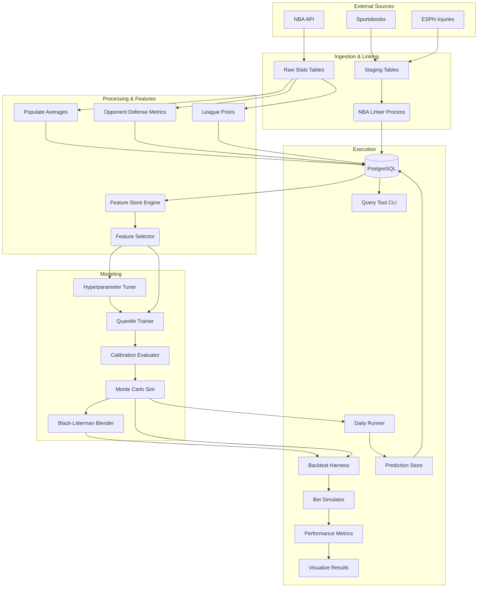

# GameFlowData Architecture

This document describes the system architecture, design patterns, and data flows for **GameFlowData**, an NBA analytics and machine learning platform for player prop betting markets.

---

## High-Level Overview

GameFlowData is a data-intensive application that ingests raw NBA game statistics and sportsbook odds, normalizes and links them, trains advanced machine learning models (Quantile Regression + Monte Carlo), and evaluates performance via a rigorous time-travel backtesting harness.

### Core Goals
1.  **Precision Data:** Accurate, pace-adjusted, and opponent-specific metrics.
2.  **Probabilistic Modeling:** Predicting full probability distributions (not just means) to price derivatives.
3.  **Backtesting Rigor:** Preventing look-ahead bias to realistically simulate betting edges.

---

## Technology Stack

| Layer | Components | Purpose |
|-------|------------|---------|
| **Language** | Python 3.11+ | Core runtime |
| **Database** | PostgreSQL 15+ (Supabase) | Primary relational store |
| **ORM/Data** | SQLAlchemy 2.0, Pandas 3.0, Psycopg2 | Data access and manipulation |
| **ML Core** | XGBoost, Scikit-Learn, NumPy, SciPy | Quantile regression, isotonic calibration, statistics |
| **HPO** | Optuna | Bayesian hyperparameter optimization |
| **API** | FastAPI, Uvicorn, Pydantic | Web framework (future live pipeline) |
| **Data Sources** | nba_api, The Odds API, ESPN | NBA stats, sportsbook odds, injury reports |
| **Pipeline** | Custom Python orchestration | Training, inference, and backfill jobs |
| **Visualization** | Plotly | Backtest equity curves and diagnostic plots |
| **Testing** | Pytest, Pytest-Cov | Unit and integration testing |
| **Linting/Types** | Ruff, Pyright | Code quality and static analysis |

---

## Directory Structure

```
GameFlowData/
├── src/                        # Main source code
│   ├── db/                     # Database connection layer
│   ├── scrapers/               # Data ingestion (13 modules)
│   ├── processing/             # Data pipeline: linking, averages, backfill
│   ├── models/                 # ML core: features, training, inference, storage
│   ├── backtesting/            # Historical replay and bet simulation
│   ├── tools/                  # CLI query tools
│   └── orchestration/          # Daily workflow coordination
├── tests/                      # Unit and integration tests (33 modules)
├── docs/                       # Component-level documentation
├── notebooks/                  # Jupyter notebooks for research
├── database/                   # Schema definitions (schema.sql)
├── data/linker_data/           # Local CSV cache for linking pipeline
├── backtest_results/           # Backtest output and analysis
├── pyproject.toml              # Project config, deps, ruff/pytest settings
├── requirements.txt            # Production ML/data dependencies
├── requirements-dev.txt        # Dev/test dependencies
├── pytest.ini                  # Test runner configuration
└── alembic.ini                 # Database migration configuration
```

---

## System Components

### 1. Database Layer (`src/db/`)

**`client.py`** — Singleton SQLAlchemy engine with connection pooling.
- Pool size 5, max overflow 2, 5-minute connection recycle.
- 5-minute statement timeout.
- pgBouncer compatible.

### 2. Data Collection & "The Linker"

The system ingests data from two distinct worlds that don't natively share identifiers:
1.  **Official NBA Data:** (Via `nba_api`) Game stats, player bios, team box scores.
2.  **Sportsbook Data:** (Via The Odds API) Player props, game lines, futures.
3.  **Injury Data:** (Via RapidAPI + ESPN) Historical injury backfill from 2021 via RapidAPI NBA Injury Reports API; ongoing daily collection via ESPN scraper.

#### Scrapers (`src/scrapers/`)

| Module | Purpose |
|--------|---------|
| `nba_unified_scraper.py` | CLI tool for team game stats and player advanced metrics from NBA API |
| `daily_player_props_scraper.py` | Daily player prop lines from Odds API |
| `daily_game_lines_scraper.py` | Daily game spreads and totals |
| `live_odds_scraper.py` | Real-time odds from multiple sportsbooks |
| `espn_injury_scraper.py` | ESPN injury reports and player status |
| `nba_player_position.py` | Player position data |
| `injury_database.py` | Injury data management |
| `injury_scraper_job.py` | Scheduled injury updates |
| `update_league_position_averages.py` | League-wide position average baselines |
| `update_player_position_history.py` | Historical player position tracking |
| `player_prop_scraper.py` | Alternate player props source |
| `game_lines_scraper.py` | Historical game lines |
| `rapidapi_injury_backfill.py` | Historical injury data backfill from RapidAPI (2021-present, 88K+ rows) |

#### The NBA Linker (`src/processing/nba_linker_local.py`)

Serves as the bridge between NBA and sportsbook data:
- **Fuzzy Matching:** Matches variations of player names (e.g., "Luka Doncic" vs "Luka Dončić") and team names.
- **Date Alignment:** Handles timezone differences and scheduling quirks (e.g., ±90 day fuzzy windows for futures).
- **Staging Tables:** Data first lands in `raw_*_staging` tables before being linked to official `game_id` and `player_id`.
- **Manual Overrides:** `data/linker_data/player_mappings.csv` for edge cases.
- **Unmatched Output:** Writes `unmatched_*.csv` files for human review.
- **Commands:** `download`, `process`, `upload`.

### 3. Processing Pipeline (`src/processing/`)

| Module | Purpose |
|--------|---------|
| `populate_average_stats.py` | Computes L5, L15, season-to-date rolling averages for players and teams. Batch insert (100 rows). |
| `backfill_opponent_allowed.py` | Computes opponent defensive metrics by position → `team_allowed_by_position` table. |
| `backfill_league_priors.py` | Computes league-wide Bayesian priors → `league_priors_history` table. |
| `backfill_team_ids.py` | Validates and links team IDs across data sources. |
| `feature_selection.py` | `ImprovedFeatureSelector` — per-quantile feature selection with time-series aware 3-split CV and permutation importance. |
| `link_injury_data.py` | Links RapidAPI injury records to NBA player/team IDs via 3-tier cascade: manual CSV overrides → exact normalized match → SequenceMatcher fuzzy match (threshold 0.80, +0.15 last name bonus). 99.3% coverage. |

### 4. Feature Store (`src/models/feature_store.py`)

Centralized engine for converting raw stats into model-ready features.

**Key Capabilities:**
- **Vectorized SQL Generation:** Uses PostgreSQL `LATERAL JOIN`s to compute complex rolling windows (L5, L15, Season) for thousands of players instantly.
- **Time-Travel Safety:** Strictly enforces `game_date < target_date` inequalities to prevent data leakage.
- **Contextual Features:**
    - **Pace-Adjusted Opponent Defense:** e.g., "Opponent allows X threes per 100 possessions."
    - **Rest & Schedule (B2):** `rest_days`, `is_back_to_back`, `games_in_last_7_days` — pre-computed in `player_average_game_stats` from game date diffs.
    - **Short-Window Trends (B3):** L3 rolling averages (`player_avg_{stat}_l3`), momentum ratios (`player_{stat}_l3_l15_ratio`), and L5 standard deviations (`player_std_{stat}_l5`) for all stats.
    - **Minutes Stability (B4):** `player_min_std_l5`, `player_min_floor_l5`, `player_games_started_l5` — distinguishes locked-in starters from volatile rotation players.
    - **Injury Context (B1):** `team_out_count`, `team_out_min_sum`, `team_out_pts_sum`, `team_out_reb_sum`, `team_out_ast_sum`, `team_out_usg_sum` (teammate injuries), `opp_out_count`, `opp_out_min_sum` (opponent injuries), `player_is_questionable`, `player_is_probable` (player's own status). Computed via two separate SQL LATERAL JOINs (game stats + advanced stats) to `rapidapi_injuries` table with temporal integrity (report_date ≤ game_date).
    - **Betting Signals:** Implied totals and team-directional spreads as proxies for game script. `line_spread` is negative when the player's team is favored (home games with `matchup LIKE '%vs.%'`).
    - **Prop Line Centering:** Per-stat player prop lines (`prop_line_pts`, `prop_line_reb`, `prop_line_ast`, `prop_line_threes`) from `raw_player_props_combined`. Enables residual modeling — the model learns deviations from market expectation rather than absolute values.
- **League-Average Defaults:** Missing feature values default to league averages instead of 0 — `avg_pace_l5=99.5`, `avg_def_rtg_l5=112.0`, `avg_fg3a_l5=34.0`, `avg_fg3_pct_l5=0.36`, `avg_usg_pct_l5=0.20`, `avg_ts_pct_l15=0.56`, `avg_reb_pct_l5=0.10`, `avg_ast_pct_l5=0.15`, `off_rtg_allowed=112.0`. Prevents extreme outlier feature values for early-season games and rookies.
- **Train/Serve Consistency:** All 4 query paths (training, date, date_range, single-player) use identical SQL patterns — date-based LATERAL JOINs for rolling stats, matching thresholds (`min >= 5`), and consistent COALESCE defaults.

**API Methods:**
- `get_player_game_features()` — Single player-game feature vector.
- `get_features_for_date()` — All players for a given date.
- `get_features_for_date_range()` — Time-series dataset across date range.
- `get_training_dataset()` — Full training data for season(s).

**Feature Groups:**
- `RATE_FEATURES_PTS` / `_REB` / `_AST` / `_THREES` — Per-stat rate model features. Each includes its corresponding `prop_line_*` centering feature plus B3 trend/variability features (`player_avg_{stat}_l3`, `player_{stat}_l3_l15_ratio`, `player_std_{stat}_l5`).
- `MINUTES_FEATURES` — Playing time prediction features (includes `line_spread`, `line_total`, B2 rest/schedule, B3 minutes L3 trend, B4 minutes stability).
- Configuration via `FeatureConfig` dataclass.

### 5. Machine Learning Pipeline (`src/models/`)

The modeling engine predicts the probability distribution of player stats.

#### Stage A: Quantile Regression (`quantile_trainer.py`)

- `PlayerPropsModelPipeline` class with `QuantileModelConfig` dataclass.
- Trains multiple **XGBoost** models for each target stat (Points, Rebounds, Assists, Threes).
- **Per-Quantile Optimization:** Each quantile (10th, 25th, 50th, 75th, 90th) selects its own optimal feature set.
    - *Example:* "Floor" (Q10) models might prioritize minutes played, while "Ceiling" (Q90) models prioritize usage rate and pace.
- **Isotonic Calibration:** Post-processing step to ensure monotonic predictions (`Q10 <= Q25 <= ...`).
- **Conformal Recalibration:** After training each quantile, computes validation residuals `(y_val - pred)`. If coverage gap exceeds 3%, applies a conformal offset `delta = np.quantile(residuals, q)` at prediction time. Addresses zero-inflated distributions (e.g., `threes_per_min`) where XGBoost's `quantileerror` objective cannot learn the correct quantile. Offsets persisted in model artifacts.
- Default hyperparameters: `n_estimators=1000`, `max_depth=5`, `learning_rate=0.03`, `early_stopping_rounds=50`.

#### Stage B: Hyperparameter Tuning (`hyperparameter_tuner.py`)

- `QuantileHyperparameterTuner` class using **Optuna**.
- Objective: minimize max calibration gap (not raw loss).
- Supports per-quantile or shared hyperparameters.
- Search space: depth, learning rate, L1/L2 regularization, subsample, colsample.

#### Stage C: Monte Carlo Simulation (`monte_carlo.py`)

- `MonteCarloPredictor` class with `PropPrediction` dataclass.
- Combines the outputs of:
    1.  **Minutes Model:** Predicts playing time distribution.
    2.  **Rate Model:** Predicts stats-per-minute distribution.
- Simulates 10,000+ outcomes per player to generate a final probability density function.
- **Gaussian Copula Sampling (C0):** Minutes and per-minute rates are correlated (PTS ρ=0.314, AST ρ=0.176). Rather than sampling independently and applying a post-hoc hack, the predictor uses a Gaussian copula:
    1. Shared latent normal `z_minutes ~ N(0,1)` across all stats
    2. Per-stat: `z_rate = ρ·z_minutes + √(1-ρ²)·z_independent`
    3. Transform to uniform via `Φ(z)`, map through marginal inverse CDFs
    4. This preserves both marginal distributions exactly while inducing the correct rank dependency
    - Copula parameters (Spearman ρ) are computed at training time and saved as `copula_params.json` artifact
    - Falls back to legacy post-hoc adjustment when copula params unavailable (backward compat)
- **Zero-Inflation Handling:** `_build_extended_quantile_fn()` snaps quantile values below `ZERO_SNAP_THRESHOLD` (1e-3) to exactly 0. Ensures MC samples in the zero-mass region of discrete distributions (e.g., threes_per_min) map to 0 instead of tiny positive interpolated values. Works in both copula and non-copula paths.
- **Output:** Exact probabilities for any line (e.g., "Probability of 20+ points").
- **Betting utilities:** `prob_over(line)`, `prob_under(line)`, `expected_value_over/under(line, odds)`.

#### Stage D: Calibration (`calibration.py`)

- `CalibrationEvaluator` class with `CalibrationReport` dataclass.
- Checks: P(actual < predicted_q) ≈ q for each quantile.
- Tolerance-based validation: `CALIBRATION_TOLERANCE = 0.05`, `CALIBRATION_HARD_FAIL = 0.10`.

#### Stage E: Probability Blending (`black_litterman.py`)

Anchors the model's overconfident probability estimates to the market's well-calibrated prior using a log-odds Bayesian blend. Sits between Monte Carlo output and the bet simulator.

- `BlackLittermanBlender` class with `BLConfig` dataclass.
- **Prior:** Devigged sportsbook probability (vig removed via multiplicative normalization, equivalent to Shin's method for 2-outcome markets).
- **View:** Model's empirical P(over) from MC samples.
- **Confidence:** Per-prediction confidence from MC distribution properties:
  ```
  z = |mean(samples) - line| / std(samples)
  confidence = 1 - exp(-0.5 * z²)
  ```
  z~0 → confidence~0 (line at center, posterior ≈ market). z~2 → confidence~0.86 (strong model disagreement).
- **Blending (log-odds space):**
  ```
  w = min(tau × confidence, max_weight)
  posterior_logit = market_logit + w × (model_logit - market_logit)
  posterior = sigmoid(posterior_logit)
  ```
- **Parameters:** `tau` (global scaling, 0.01–0.30, default 0.05), `max_weight` (hard cap, default 0.50), `min_prob`/`max_prob` (clamping to avoid log(0)).
- **Key property:** When tau=0 or confidence=0, posterior = market → no edge → no bet. Model influence scales with both global trust (tau) and per-prediction confidence.
- **Integration:** Wired into `_calculate_edges()` in `backtest_harness.py` via `--bl-tau` CLI flag. Disabled by default (backward compatible).

#### Training Orchestrator (`train_pipeline.py`)

- `TrainingOrchestrator` class — orchestrates full training workflow.
- Optional Optuna hyperparameter tuning.
- Feature selection integration.
- Calibration validation (individual + combined minutes×rate).
- Minutes-rate correlation analysis with Spearman rank correlations.
- Computes and saves Gaussian copula parameters (`copula_params.json`) for MC inference.
- Model persistence via `joblib`.

#### Daily Runner (`daily_runner.py`)

- `DailyPredictionRunner` class — production inference pipeline.
- Workflow: get today's games (NBA API ScoreboardV2) → filter injured players (`rapidapi_injuries`) → build features → batch predict (4 XGBoost calls) → enrich with opponents → fetch prop lines → calculate edges → return `(predictions_df, samples_dict)`.
- **Game Discovery:** Primary source is `nba_api.stats.endpoints.ScoreboardV2` (works for scheduled/future games). Falls back to `team_game_stats` DB query for past dates when NBA API is unavailable.
- **Injury Filtering:** Queries `rapidapi_injuries` table by `player_id` (integer matching). Uses most recent `report_date` on or before target date. Filters players with `status = 'Out'`.
- **Batch Prediction:** Uses `predict_batch_for_date()` — 4 total XGBoost calls (1 minutes + 3 rates) for all players, instead of N per-player calls.
- **Sharpest-Book Selection:** Fetches lines from all bookmakers via `ROW_NUMBER() OVER (PARTITION BY ... ORDER BY snapshot_time DESC)` to get only the latest snapshot, then selects the lowest-vig (smallest booksum) line per player/game/market. Applies multiplicative devigging to implied probabilities for edge calculation.
- **Edge Calculation:** Uses MC samples empirical CDF (`(samples > line).mean()`) for probability estimation. Falls back to 5-point quantile interpolation when samples are unavailable.

#### Prediction Storage (`prediction_store.py`)

- `PredictionStore` class — stores and retrieves daily predictions and MC samples.
- **Predictions:** Upserted to `daily_predictions` table via `psycopg2.extras.execute_values` with `ON CONFLICT DO UPDATE`. Stores quantiles, edges, implied probabilities, and prop line info.
- **MC Samples:** Gzip-compressed `float64` numpy arrays stored as PostgreSQL `BYTEA` in `daily_prediction_samples` table (~20-40KB per prediction for 10K samples).
- **Retrieval:** `get_predictions()` for filtered queries, `get_samples()` for decompressing arrays, `get_player_id_by_name()` for fuzzy name lookup.

#### Query Tool (`src/tools/query_player.py`)

CLI tool for querying stored daily predictions. Three modes:
1. **Line query:** Player + stat + line → compute over/under probability from stored MC samples + optional EV at given odds.
2. **Player overview:** All predictions for a player on a date.
3. **Top edges:** Top N predictions by absolute edge for a date.

#### Analysis & Diagnostics

| Module | Purpose |
|--------|---------|
| `analyze_calibration_drift.py` | Post-hoc calibration analysis. Detects drift in quantile coverage over time. |
| `analyze_minutes_bimodality.py` | Diagnostic for minutes distribution shape. Finding: bimodality is not real (closed). |

### 6. Backtesting Harness (`src/backtesting/`)

A simulation environment to validate betting strategies.

| Module | Purpose |
|--------|---------|
| `backtest_harness.py` | Core engine — day-by-day historical replay with blind predictions. `BacktestResult` dataclass. Integrates optional BL blending in `_calculate_edges()`. |
| `bet_simulator.py` | `Bet` and `BetOutcome` classes. `BetSide` enum (OVER/UNDER). P&L tracking per bet. Stores BL `posterior_prob` diagnostic. |
| `performance_metrics.py` | `PerformanceMetrics` dataclass — ROI, hit rate, Sharpe ratio, drawdown, Brier score. |
| `run_backtest.py` | CLI entry point. Accepts date range, model paths, output directory. |
| `run_sweep.py` | Parameter sweep tool — runs Phase 0-1 once, then sweeps `(tau, edge_threshold, kelly_fraction)` grid. Saves per-config subdirectories compatible with `visualize_results.py`. |
| `visualize_results.py` | Self-contained HTML dashboard: bankroll growth chart, daily P&L bars, metrics summary cards, enriched bet log table (player names/teams from DB), other bookmaker lines comparison. Sortable/filterable via vanilla JS. |

**Key Capabilities:**
- **Historical Replay:** Iterates through past seasons day-by-day.
- **Blind Predictions:** Models only see data available *before* tip-off.
- **Betting Simulation:**
    - **Line Shopping:** Independently selects best over line and best under line across bookmakers per (player, game, stat), ensuring both sides are considered even when they come from different bookmakers.
    - **Kelly Criterion:** Sizes bets based on calculated edge and bankroll.
    - **ROI Analysis:** Tracks bankroll growth, drawdown, and win rates.
- **Edge Calculation:** `_calculate_edges()` method determines bet eligibility. Both paths use multiplicative devigging to remove bookmaker vig before computing edges:
    - **Default (BL disabled):** Raw empirical CDF → edge vs devigged implied probability.
    - **BL enabled (`--bl-tau`):** Devigged market prior + log-odds BL blending → edge = posterior_prob - devigged_market_prob. Adds diagnostic columns: `model_over/under`, `market_over/under`, `confidence`, `posterior_over/under`.
- **Parameter Sweep:** `run_sweep.py` enables efficient grid search across BL tau, edge threshold, and Kelly fraction values by caching all shared data (features, lines, actuals, MC predictions/samples) and replaying only edge calculation + bet simulation per configuration.

### 7. Query Tools (`src/tools/`)

| Module | Purpose |
|--------|---------|
| `query_player.py` | CLI tool for querying stored predictions. Modes: line probability, player overview, top edges. |

### 8. Orchestration (`src/orchestration/`)

**`run_daily.py`** — Daily workflow coordinator. Triggers the full pipeline: data scraping → linking → feature store → predictions → storage → CSV export. Supports `--skip-storage` to skip DB persistence. Stores predictions to `daily_predictions` and MC samples to `daily_prediction_samples` via `PredictionStore`.

---

## Database Schema Highlights

### Core Stats
- `player_game_stats`: Box scores (pts, reb, ast, min, etc.).
- `team_game_stats`: Team-level metrics (pace, efficiency, basic + advanced).
- `player_game_advanced_stats`: Derived metrics (usage%, TS%, PIE).

### Rolling Context (Pre-Computed)
- `player_average_game_stats`: L5/L15/Season player averages.
- `player_average_advanced_stats`: L5/L15/Season advanced metric averages.
- `team_average_game_stats`: Team rolling trends.
- `team_allowed_by_position`: **Critical defensive metric.** Tracks how well teams defend specific positions (e.g., "Celtics defense vs. Point Guards L15").

### Historical Priors
- `league_priors_history`: League-average baselines used for Bayesian shrinkage when player sample size is low (rookies/injuries).

### Injury Data
- `rapidapi_injuries`: Historical injury reports (88K+ rows, 2021-present). Columns: `player_name`, `player_id`, `team_id`, `status` (Out/Questionable/Probable/Day-To-Day), `report_date`. Linked to NBA IDs via `link_injury_data.py` (99.3% coverage).

### Betting Data
- `raw_game_lines_staging`: Spreads and totals.
- `raw_player_props_combined`: Player prop lines and odds.

### Predictions
- `daily_predictions`: Stored daily prediction quantiles, edges, and implied probabilities. Unique on `(prediction_date, player_id, game_id, stat)`. Supports upsert for re-runs.
- `daily_prediction_samples`: Gzip-compressed MC sample arrays (10K float64 values per prediction, ~20-40KB). Unique on `(prediction_date, player_id, game_id, stat)`.

### Reference
- `players`: Player reference data.
- `teams`: Team reference data.
- `player_position_history`: Position tracking over time.

---

## Data Flow Diagram



---

## Entry Points & CLI

### Scrapers
```bash
python src/scrapers/nba_unified_scraper.py [--season YYYY-YY] [--season-type TYPE] [--skip-team] [--skip-advanced]
python src/scrapers/daily_player_props_scraper.py [--live|--date YYYY-MM-DD] [--combos|--combos-only|--markets M1 M2]
python src/scrapers/player_prop_scraper.py [--start-date YYYY-MM-DD] [--end-date YYYY-MM-DD] [--combos|--combos-only] [--dry-run]
python src/scrapers/daily_game_lines_scraper.py
```

### Processing
```bash
python src/processing/nba_linker_local.py [download|process|upload]
python src/processing/populate_average_stats.py [--season YYYY-YY] [--table player]
python src/processing/backfill_opponent_allowed.py
python src/processing/backfill_league_priors.py
```

### Training
```bash
python -m src.models.train_pipeline [--tune-hyperparams] [--tuning-trials N]
python -m src.models.hyperparameter_tuner [--n-trials 50] [--timeout 3600]
```

### Backtesting
```bash
python src/backtesting/run_backtest.py --start YYYY-MM-DD --end YYYY-MM-DD
python src/backtesting/run_backtest.py --start YYYY-MM-DD --end YYYY-MM-DD --bl-tau 0.05  # Enable BL blending
python src/backtesting/run_backtest.py --start YYYY-MM-DD --end YYYY-MM-DD --allowed-bets pts:under reb:over
python src/backtesting/visualize_results.py --results-dir backtest_results/

# Parameter sweep (BL tau × edge threshold × Kelly fraction)
python src/backtesting/run_sweep.py \
    --start YYYY-MM-DD --end YYYY-MM-DD \
    --model-dir src/models/artifacts/run_YYYYMMDD_HHMMSS \
    --tau none 0.03 0.05 0.09 0.15 \
    --edge 0.03 0.05 0.07 \
    --kelly 0.10 0.125 0.15 \
    --n-samples 10000 --stats pts reb ast
```

### Daily Workflow
```bash
python src/orchestration/run_daily.py [--date YYYY-MM-DD] [--skip-scraping] [--skip-processing] [--skip-inference] [--skip-storage]
```

### Query Predictions
```bash
# Probability of a player scoring over a line
python src/tools/query_player.py --player "Cade Cunningham" --stat pts --line 25.5

# Same query with EV at given odds
python src/tools/query_player.py --player "Cade Cunningham" --stat pts --line 25.5 --odds -110

# All predictions for a player
python src/tools/query_player.py --player "Cade Cunningham"

# Top edges for today
python src/tools/query_player.py --top 20

# Top edges for a specific date
python src/tools/query_player.py --date 2026-01-29 --top 10
```

---

## Testing Architecture

**Framework:** Pytest with pytest-cov (60% coverage target).

**Test Organization:** 33 test modules in `tests/` mirroring `src/` structure. Each source module has a corresponding `test_*.py`.

**Test Categories (markers):**
- `unit` — Isolated logic tests with mocks.
- `integration` — Tests requiring database or external services.
- `slow` — Long-running tests (backtesting, full pipeline).

**Patterns:**
- Mock-based unit tests with proper fixtures for database interactions.
- Time-series aware validation (chronological ordering enforced).
- All scrapers tested with mocked HTTP responses.

**Configuration:** `pyproject.toml` contains pytest, coverage, and ruff settings. Line length 120, Python 3.11 target.

---

## Critical Invariants & Rules

1.  **Temporal Integrity:**
    - **Rule:** Feature generation must ONLY use data where `game_date < target_game_date`.
    - **Reason:** Prevents "look-ahead bias" where the model accidentally learns from the future (e.g., knowing a player played 40 minutes makes predicting points too easy).

2.  **Minutes Dependency:**
    - **Rule:** We model **Rate** (Stats per Minute) and **Minutes** separately.
    - **Reason:** Variance in NBA stats is heavily driven by playing time. Predicting them independently allows for more robust handling of blowouts or overtime.

3.  **Bayesian Fallback:**
    - **Rule:** If a player has < 5 games of history, blend their stats with `league_priors_history`.
    - **Reason:** Prevents wild outliers for rookies or players returning from long injuries.

4.  **Quantile Crossing:**
    - **Rule:** `Q10 <= Q25 <= Q50 <= Q75 <= Q90`.
    - **Reason:** Statistical necessity. If raw model output violates this (e.g., Q90 < Q75), isotonic regression is applied to force monotonicity.

5.  **Empirical CDF (not Gaussian):**
    - **Rule:** Probability of over/under is computed as `(samples > line).mean()`, never via Gaussian CDF.
    - **Reason:** Monte Carlo distributions are non-Gaussian. Gaussian CDF produces phantom edges (see ACTIONITEMS.md — Key Findings Archive).

---

## Known Issues & Active Research

See `ACTIONITEMS.md` for full details.

**Root finding (2026-01-28):** The model is catastrophically overconfident on probability estimates. Quantile calibration (Q10–Q90) is good, but translating MC distributions into betting probabilities via `(samples > line).mean()` amplifies small mean shifts into extreme P(over) values. Brier score 0.2705 (worse than naive 0.2500).

**Black-Litterman blending (A3) — Implemented (2026-01-28):** The BL blending layer is complete and integrated into the backtesting pipeline. Anchors model probabilities to the devigged market prior using log-odds space blending with per-prediction z-score confidence. Activated via `--bl-tau` flag (default: disabled). Needs validation backtest via `run_sweep.py` to find optimal tau, edge, and Kelly parameters.

**Bug fix sweep (2026-01-30):** 12 issues fixed from comprehensive pipeline audit — see `ISSUES.md`. Key fixes: minutes model hyperparameters (ISS-001), early stopping (ISS-006), devigged edge calculation (ISS-003), injury query cross-product (ISS-004), train/serve threshold alignment (ISS-005), team-directional spread (ISS-008), league-average defaults (ISS-009), independent over/under line shopping (ISS-015). 16 issues remain open (mostly low-priority).

**Calibration fixes (2026-01-31):** THREES rate model Q0.10 had +20.4% calibration gap during training (coverage 0.352 vs target 0.10). Root cause: zero-inflated distribution — 35%+ of `threes_per_min` samples are exactly 0, which XGBoost's `quantileerror` objective cannot learn. Three fixes applied:
1. **Conformal recalibration** (quantile_trainer.py) — post-training offset from validation residuals closes coverage gaps > 3%.
2. **Zero-snap handling** (monte_carlo.py) — values below 1e-3 in inverse CDF snapped to exactly 0.
3. **Threes in combined calibration** (train_pipeline.py) — combined calibration eval now includes all trained rate models, not just `[pts, reb, ast]`.

**BL parameter sweep results (2026-01-31):** Comprehensive sweep revealed:
- **No-BL configs are profitable:** +3% ROI, 600-873 bets across edge/Kelly combinations. REB is the strongest stat at +7.9% ROI.
- **ALL BL configs produce 0-12 bets:** The BL confidence formula `confidence = 1 - exp(-0.5 * z²)` produces near-zero values for realistic betting edges. For a 3% raw edge (P(over)=0.55), z~0.13, confidence~0.008. Combined with tau, `w = tau * confidence` is vanishingly small (~0.0008), crushing edges below any practical threshold.
- **Structural issue:** The BL layer as currently designed cannot pass through profitable edges — this is a design flaw in the confidence function, not a model quality issue. The model DOES find edges (visible in no-BL results), but BL destroys them.
- **Recommended fix (pending):** Use tau as a fixed blending weight (skip confidence scaling), change the confidence function to be less aggressive, or use BL only for position sizing rather than edge filtering.

**Active tracks:**
- **Track A** (Critical): Probability recalibration — A1–A4 all implemented. A5 (residual classifier) pending evaluation. A6 (conditional rate modeling) added as future option. BL (A3) has structural confidence function issue — see above.
- **Track B** (Complete): New signal sources — B1 (injury context, 10 features), B2 (rest/schedule), B3 (short-window trends), B4 (minutes stability) all implemented and included in latest training run.
- **Track C**: Calibration refinement — C0 (Gaussian copula) implemented and active. C1 (Q10 over-coverage) partially addressed by conformal recalibration. C2 (per-stat calibration) pending.
- **Track D**: Deprioritized model items (pending recalibration).
- **Track E**: Go-live pipeline — no-BL path shows positive ROI (+3%). BL fix needed before BL-based edge filtering is viable.

**Prediction storage + query tool (2026-01-31):** Daily predictions and MC samples now persisted to PostgreSQL (`daily_predictions` + `daily_prediction_samples` tables). CLI query tool (`src/tools/query_player.py`) enables ad-hoc probability queries against stored distributions. Daily runner refactored: NBA API ScoreboardV2 for game discovery, `rapidapi_injuries` for injury filtering, MC samples for edge calculation, `ROW_NUMBER` snapshot ranking for line freshness.

**Current state (2026-01-31):** Models retrained with all bug fixes and new features — latest complete artifact: `run_20260129_205540`. Daily inference pipeline fully wired to DB storage. Calibration fixes (conformal recalibration, zero-snap, threes eval) applied but models need retraining to incorporate. No-BL backtest shows +3% ROI (REB +7.9%). BL blending has structural confidence function issue that kills all edges — needs redesign before use. Next step: retrain with calibration fixes, then evaluate no-BL strategy for paper trading or fix BL confidence function.
