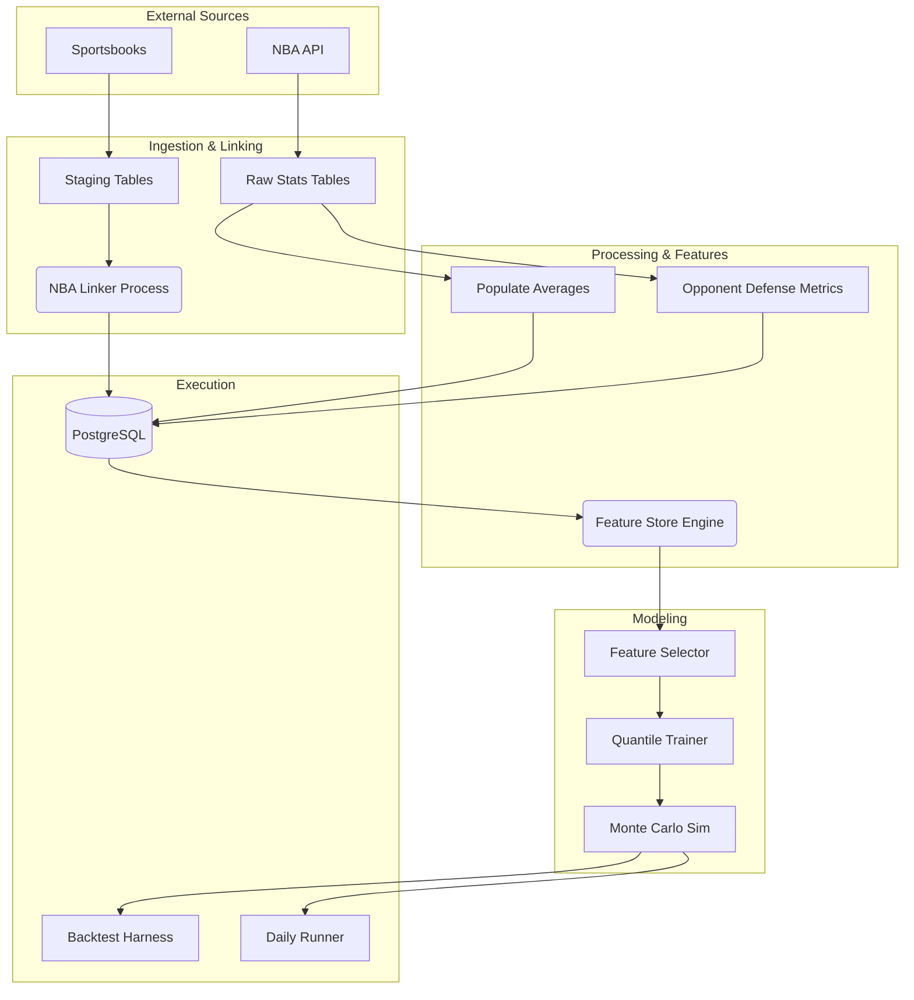

# GameFlowData Architecture

This document describes the system architecture, design patterns, and data flows for **GameFlowData**, an NBA analytics and machine learning platform for player prop betting markets.

---

## High-Level Overview

GameFlowData is a data-intensive application that ingests raw NBA game statistics and sportsbook odds, normalizes and links them, trains advanced machine learning models (Quantile Regression + Monte Carlo), and evaluates performance via a rigorous time-travel backtesting harness.

### Core Goals
1.  **Precision Data:** Accurate, pace-adjusted, and opponent-specific metrics.
2.  **Probabilistic Modeling:** Predicting full probability distributions (not just means) to price derivatives.
3.  **Backtesting Rigor:** Preventing look-ahead bias to realistically simulate betting edges.

---

## Technology Stack

| Layer | Components | Purpose |
|-------|------------|---------|
| **Language** | Python 3.11+ | Core runtime |
| **Database** | PostgreSQL 15+ (Supabase) | Primary relational store |
| **ORM/Data** | SQLAlchemy 2.0, Pandas, Psycopg2 | Data access and manipulation |
| **ML Core** | XGBoost, Scikit-Learn, NumPy | Quantile regression and isotonic calibration |
| **Pipeline** | Custom Python Orchestration | Training, inference, and backfill jobs |
| **Testing** | Pytest, Pytest-Cov | Unit and integration testing |

---

## System Components

### 1. Data Collection & "The Linker"
The system ingests data from two distinct worlds that don't natively share identifiers:
1.  **Official NBA Data:** (Via `nba_api`) Game stats, player bios, team box scores.
2.  **Sportsbook Data:** (Via The Odds API) Player props, game lines, futures.

**The `NBA Linker` (`src/processing/nba_linker_local.py`)** serves as the bridge:
- **Fuzzy Matching:** Matches variations of player names (e.g., "Luka Doncic" vs "Luka Dončić") and team names.
- **Date Alignment:** Handles timezone differences and scheduling quirks (e.g., ±90 day fuzzy windows for futures).
- **Staging Tables:** Data first lands in `raw_*_staging` tables before being linked to official `game_id` and `player_id`.

### 2. Feature Store (`src/models/feature_store.py`)
Centralized engine for converting raw stats into model-ready features.

**Key Capabilities:**
- **Vectorized SQL Generation:** Uses PostgreSQL `LATERAL JOIN`s to compute complex rolling windows (L5, L15, Season) for thousands of players instantly.
- **Time-Travel Safety:** strictly enforces `game_date < target_date` inequalities to prevent data leakage.
- **Contextual Features:**
    - **Pace-Adjusted Opponent Defense:** e.g., "Opponent allows X threes per 100 possessions."
    - **Rest & Travel:** Days rest, distance traveled, timezone shifts.
    - **Betting Signals:** Implied totals and spreads as proxies for game script.

### 3. Machine Learning Pipeline (`src/models/`)
The modeling engine predicts the probability distribution of player stats.

**Stage A: Quantile Regression (`quantile_trainer.py`)**
- Trains multiple **XGBoost** models for each target stat (Points, Rebounds, Assists).
- **Per-Quantile Optimization:** Each quantile (10th, 25th, ... 90th) selects its own optimal feature set.
    - *Example:* "Floor" (Q10) models might prioritize minutes played, while "Ceiling" (Q90) models prioritize usage rate and pace.
- **Isotonic Calibration:** Post-processing step to ensure monotonic predictions (`Q10 <= Q25 <= ...`).

**Stage B: Monte Carlo Simulation (`monte_carlo.py`)**
- Combines the outputs of:
    1.  **Minutes Model:** Predicts playing time distribution.
    2.  **Rate Model:** Predicts stats-per-minute distribution.
- Simulates 10,000+ outcomes per player to generate a final probability density function.
- **Output:** Exact probabilities for any line (e.g., "Probability of 20+ points").

### 4. Backtesting Harness (`src/backtesting/`)
A simulation environment to validate betting strategies.
- **Historical Replay:** Iterates through past seasons day-by-day.
- **Blind Predictions:** Models only see data available *before* tip-off.
- **Betting Simulation:**
    - **Line Shopping:** Selects the best available line across bookmakers.
    - **Kelly Criterion:** Sizes bets based on calculated edge and bankroll.
    - **ROI Analysis:** Tracks bankroll growth, drawdown, and win rates.

---

## Database Schema Highlights

### Core Stats
- `player_game_stats`: Box scores (pts, reb, ast).
- `team_game_stats`: Team-level metrics (pace, efficiency).
- `player_game_advanced_stats`: Derived metrics (usage%, TS%, PIE).

### Rolling Context (Pre-Computed)
- `player_average_game_stats`: L5/L15/Season averages.
- `team_average_game_stats`: Team trends.
- `team_allowed_by_position`: **Critical defensive metric**. Tracks how well teams defend specific positions (e.g., "Celtics defense vs. Point Guards L15").

### Historical Priors
- `league_priors_history`: League-average baselines used for Bayesian shrinkage when player sample size is low (rookies/injuries).

### Betting Data
- `raw_game_lines_staging`: Spreads and totals.
- `raw_player_props_combined`: Player prop lines and odds.

---

## Data Flow Diagram

---

## Critical Invariants & Rules

1.  **Temporal Integrity:**
    - **Rule:** Feature generation must ONLY use data where `game_date < target_game_date`.
    - **Reason:** Prevents "look-ahead bias" where the model accidentally learns from the future (e.g., knowing a player played 40 minutes makes predicting points too easy).

2.  **Minutes Dependency:**
    - **Rule:** We model **Rate** (Stats per Minute) and **Minutes** separately.
    - **Reason:** Variance in NBA stats is heavily driven by playing time. Predicting them independently allows for more robust handling of blowouts or overtime.

3.  **Bayesian Fallback:**
    - **Rule:** If a player has < 5 games of history, blend their stats with `league_priors_history`.
    - **Reason:** Prevents wild outliers for rookies or players returning from long injuries.

4.  **Quantile Crossing:**
    - **Rule:** `Q10 <= Q25 <= Q50 <= Q75 <= Q90`.
    - **Reason:** Statistical necessity. If raw model output violates this (e.g., Q90 < Q75), isotonic regression is applied to force monotonicity.