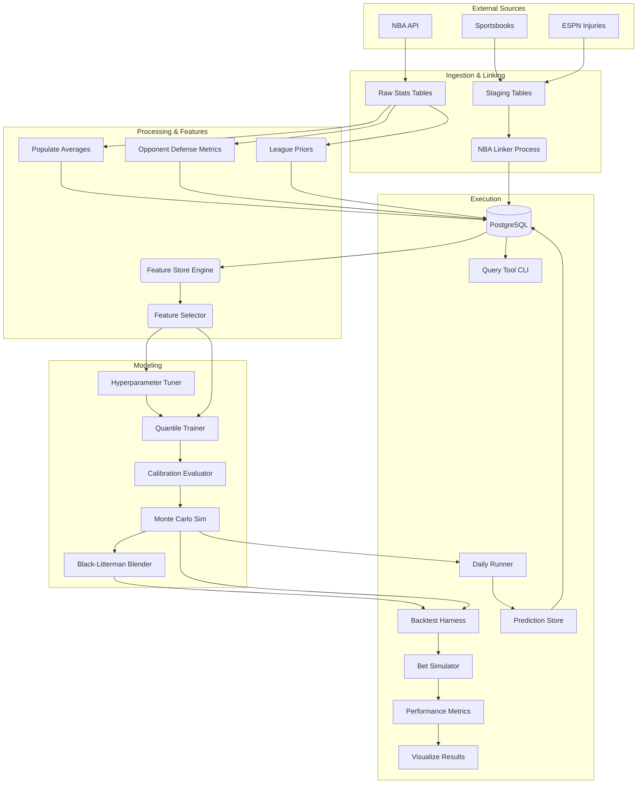

# GameFlowData Architecture

This document describes the system architecture, design patterns, and data flows for **GameFlowData**, an NBA analytics and machine learning platform for player prop betting markets.

---

## High-Level Overview

GameFlowData is a data-intensive application that ingests raw NBA game statistics and sportsbook odds, normalizes and links them, trains advanced machine learning models (Quantile Regression + Monte Carlo), and evaluates performance via a rigorous time-travel backtesting harness.

### Core Goals
1.  **Precision Data:** Accurate, pace-adjusted, and opponent-specific metrics.
2.  **Probabilistic Modeling:** Predicting full probability distributions (not just means) to price derivatives.
3.  **Backtesting Rigor:** Preventing look-ahead bias to realistically simulate betting edges.

---

## Technology Stack

| Layer | Components | Purpose |
|-------|------------|---------|
| **Language** | Python 3.11+ | Core runtime |
| **Database** | PostgreSQL 15+ (Supabase) | Primary relational store |
| **ORM/Data** | SQLAlchemy 2.0, Pandas 3.0, Psycopg2 | Data access and manipulation |
| **ML Core** | XGBoost, Scikit-Learn, NumPy, SciPy | Quantile regression, isotonic calibration, statistics |
| **HPO** | Optuna | Bayesian hyperparameter optimization |
| **API** | FastAPI, Uvicorn, Pydantic | Web framework (future live pipeline) |
| **Data Sources** | nba_api, The Odds API, ESPN, pybaseball, CBBpy, Barttorvik | NBA stats, sportsbook odds, injury reports, MLB Statcast/FanGraphs, NCAAB box scores/efficiency |
| **Pipeline** | Custom Python orchestration | Training, inference, and backfill jobs |
| **Visualization** | Plotly | Backtest equity curves and diagnostic plots |
| **Image Gen** | Pillow | Social media pick card rendering |
| **Dashboard** | Next.js 16, TypeScript, Tailwind, Recharts | Web UI for predictions and paper trading |
| **Testing** | Pytest, Pytest-Cov | Unit and integration testing |
| **Linting/Types** | Ruff, Pyright | Code quality and static analysis |

---

## Directory Structure

```
GameFlowData/
├── src/                        # Main source code
│   ├── config/                 # Configuration (stat_config.py)
│   ├── db/                     # Database connection layer
│   ├── scrapers/               # Data ingestion (13 modules)
│   ├── processing/             # Data pipeline: linking, averages, backfill
│   ├── diagnostics/            # Database health monitoring tools
│   ├── models/                 # ML core: features, training, inference, storage
│   ├── backtesting/            # Historical replay and bet simulation
│   ├── tools/                  # CLI query tools
│   ├── orchestration/          # Daily workflow coordination
│   ├── paper_trading/          # Paper bet placement and resolution
│   └── social/                 # Social media image generation
├── dashboard/                  # Next.js web dashboard (TypeScript, Tailwind)
├── assets/fonts/               # Montserrat font files for image generation
├── tests/                      # Unit and integration tests (34 modules)
├── docs/                       # Component-level documentation
├── notebooks/                  # Jupyter notebooks for research
├── database/                   # Schema definitions (schema.sql)
├── data/linker_data/           # Local CSV cache for linking pipeline
├── backtest_results/           # Backtest output and analysis
├── logs/                       # Job execution logs (daily_stats, lines, inference)
├── cron/                       # Cron schedule templates for server deployment
├── predictions/                # Daily prediction CSV exports
├── pyproject.toml              # Project config, deps, ruff/pytest settings
├── requirements.txt            # Production ML/data dependencies
├── requirements-dev.txt        # Dev/test dependencies
├── pytest.ini                  # Test runner configuration
└── alembic.ini                 # Database migration configuration
```

---

## System Components

### 0. Configuration (`src/config/`)

**`stat_config.py`** — Per-stat configuration for betting parameters.
- `StatConfig` dataclass — per-stat settings (enabled, edge_threshold, bl_tau)
- `StatConfigSet` container — global defaults with per-stat overrides
- `parse_stat_param()` helper — parses CLI arguments like `"pts=0.10 reb=0.07"`
- Supports CLI format: `--edge-threshold pts=0.10 reb=0.07 ast=0.15` or global `--edge-threshold 0.05`
- Used by backtesting harness, bet simulator, and paper trading

### 1. Database Layer (`src/db/`)

**`client.py`** — Singleton SQLAlchemy engine with connection pooling.
- Pool size 10, max overflow 6, 5-minute connection recycle (optimized for parallel feature building).
- 5-minute statement timeout.
- pgBouncer compatible.
- **Lazy initialization:** Engine creation is deferred — module is safely importable without `DATABASE_URL` (e.g., in CI/test environments). `get_engine()` raises `ValueError` at call time if `DATABASE_URL` is missing.

### 2. Data Collection & "The Linker"

The system ingests data from two distinct worlds that don't natively share identifiers:
1.  **Official NBA Data:** (Via `nba_api`) Game stats, player bios, team box scores.
2.  **Sportsbook Data:** (Via The Odds API) Player props, game lines, futures.
3.  **Injury Data:** (Via RapidAPI) Historical backfill from 2021 and daily collection via RapidAPI NBA Injury Reports API. Data stored in `rapidapi_injuries` table with `player_id` linking via `link_injury_data.py`.

#### Scrapers (`src/scrapers/`)

| Module | Purpose |
|--------|---------|
| `nba_unified_scraper.py` | CLI tool for team game stats and player advanced metrics from NBA API |
| `daily_player_props_scraper.py` | Daily player prop lines from Odds API (regions: us, us2, us_ex, us_dfs) |
| `daily_game_lines_scraper.py` | Daily game spreads and totals |
| `live_odds_scraper.py` | Real-time odds from multiple sportsbooks |
| `espn_injury_scraper.py` | ESPN injury reports and player status |
| `nba_player_position.py` | Player position data |
| `injury_database.py` | Injury data management |
| `injury_scraper_job.py` | Scheduled injury updates |
| `update_league_position_averages.py` | League-wide position average baselines |
| `update_player_position_history.py` | Historical player position tracking |
| `player_prop_scraper.py` | Alternate player props source |
| `game_lines_scraper.py` | Historical game lines |
| `rapidapi_injury_backfill.py` | Injury data from RapidAPI — historical backfill (2021-present, 88K+ rows) and daily collection via `run_daily.py --scrape-injuries` |
| `play_type_scraper.py` | Team-level Synergy play type data (offensive/defensive frequency + efficiency) |

#### MLB Scrapers (`src/scrapers/mlb/`)

| Module | Purpose |
|--------|---------|
| `mlb_stats_scraper.py` | Game schedules and boxscores from MLB Stats API (`statsapi.mlb.com`) |
| `mlb_player_props_scraper.py` | Historical MLB player props backfill from The Odds API |
| `mlb_daily_player_props_scraper.py` | Live daily MLB player props |
| `mlb_daily_game_lines_scraper.py` | Live daily MLB game lines (moneyline, spreads, totals) |
| `mlb_reference.py` | Reference data seeding (teams, park factors) |
| `mlb_backfill.py` | Orchestrator for full boxscore season backfill |
| `mlb_statcast_scraper.py` | Daily Statcast scraper via `pybaseball` — pitch-level data aggregated to per-game batting/pitching (exit velo, barrel%, xBA, xwOBA, pitch mix, velo/spin, plate discipline) |
| `mlb_fangraphs_scraper.py` | Season-level FanGraphs advanced stats via `pybaseball` (wRC+, FIP, WAR, etc.) |
| `mlb_statcast_backfill.py` | Bulk Statcast backfill orchestrator with progress file resume |

**Data Sources:**
- **MLB Stats API** — Free, no auth. Game schedules, boxscores, player reference data.
- **pybaseball** — Free Python library wrapping Baseball Savant (Statcast pitch-level data) and FanGraphs (season-level advanced stats). Used for quality-of-contact metrics critical for MLB modeling.
- **The Odds API** — Same API as NBA, sport key `baseball_mlb`. Player props + game lines.

#### NCAAB Scrapers (`src/scrapers/ncaab/`)

| Module | Purpose |
|--------|---------|
| `ncaab_game_lines_scraper.py` | Live/historical game lines (spreads, totals, moneylines) from The Odds API (`basketball_ncaab`). Direct port of `mlb_daily_game_lines_scraper.py`. |
| `ncaab_cbbpy_scraper.py` | ESPN box scores and schedules via CBBpy package. Aggregates player-level data to team level. Computes possessions (`FGA - OREB + TOV + 0.44 * FTA`) and Four Factors inline. |
| `ncaab_barttorvik_scraper.py` | Bulk CSV download of adjusted efficiency ratings from barttorvik.com. Flexible column mapping for year-to-year header variations. Stores point-in-time snapshots. |

**Data Sources:**
- **CBBpy** — Python package wrapping ESPN D1 basketball data. Free, no auth. Returns player box scores that are aggregated to team-level stats.
- **Barttorvik/T-Rank** — Free adjusted efficiency metrics (AdjOE, AdjDE, AdjT, Barthag, Four Factors). Bulk CSV at `barttorvik.com/{season}_team_results.csv`. No API key, updates every 15 min in-season.
- **The Odds API** — Sport key `basketball_ncaab`. Game lines only (no player props for college sports — regulatory).

#### The NBA Linker (`src/processing/nba_linker_local.py`)

Serves as the bridge between NBA and sportsbook data:
- **Fuzzy Matching:** Matches variations of player names (e.g., "Luka Doncic" vs "Luka Dončić") and team names.
- **Persistent Fuzzy Cache (2026-03-03):** File-based cache at `linker_data/_fuzzy_cache.json` stores `{normalized_name: player_id_or_null}` mappings. Eliminates redundant O(n*m) SequenceMatcher runs — typical runs see 95%+ cache hits (0 new fuzzy lookups). Cache auto-invalidates when player count changes (new player added to DB). Used by both `process` and `incremental` modes.
- **Batch Player Matching (2026-03-03):** Player matching refactored from per-row `match_player()` to 3-step batch pipeline: (1) manual mappings via `.map()`, (2) exact normalized match via `.map(player_lookup)` (vectorized), (3) fuzzy cache lookup for remaining unmatched. Only truly new names trigger SequenceMatcher.
- **Team Normalization:** All team names normalized to 3-letter abbreviations (e.g., "Atlanta Hawks" → "ATL", "Los Angeles Lakers" → "LAL") for consistent matching between Odds API full names and NBA API abbreviations.
- **Date Alignment:** Handles timezone differences and scheduling quirks (e.g., ±90 day fuzzy windows for futures).
- **Staging Tables:** Data first lands in `raw_*_staging` tables before being linked to official `game_id` and `player_id`.
- **Manual Overrides:** `data/linker_data/player_mappings.csv` for edge cases.
- **Unmatched Output:** Writes `unmatched_*.csv` files for human review.
- **Commands:**
  - `download` — Pull full tables to local CSV (one-time bulk operation)
  - `process` — Match IDs locally using downloaded CSVs
  - `upload` — Push linked results back to database
  - `incremental` — **Lightweight daily mode**: queries only unlinked records (`WHERE player_id IS NULL`), matches against reference tables, updates directly via batched SQL. No CSV download. Used by `run_daily.py` for automated pipelines. Options: `--batch-size` (default 50000), `--limit` (optional cap on records to process).

### 3. Processing Pipeline (`src/processing/`)

| Module | Purpose |
|--------|---------|
| `populate_average_stats.py` | Computes L5, L15, season-to-date rolling averages for players and teams. Full recalculation for historical backfills. |
| `populate_average_stats_incremental.py` | Lightweight daily version — only processes players who played on target date. Uses batch UPSERT. Queries actual season game count for correct `games_szn`. Runtime: ~1s vs ~28min for full script. |
| `backfill_opponent_allowed.py` | Computes opponent defensive metrics by position → `team_allowed_by_position` table. Rolling windows use `.mean()` (per-game averages). |
| `backfill_opponent_allowed_incremental.py` | Lightweight daily version — only processes last 30 days with 15-day lookback buffer. Runs as Step 7 in `daily_stats_job.py`. |
| `backfill_league_priors.py` | Computes league-wide Bayesian priors → `league_priors_history` table. |
| `backfill_team_ids.py` | Validates and links team IDs across data sources. |
| `feature_selection.py` | `ImprovedFeatureSelector` — per-quantile feature selection with time-series aware 3-split CV and permutation importance. |
| `link_injury_data.py` | Links RapidAPI injury records to NBA player/team IDs via 3-tier cascade: manual CSV overrides → exact normalized match → SequenceMatcher fuzzy match (threshold 0.80, +0.15 last name bonus). 99.3% coverage. |

#### MLB Processing (`src/processing/mlb/`)

| Module | Purpose |
|--------|---------|
| `mlb_config.py` | Shared constants: rolling windows (`BATTING_WINDOWS`, `PITCHING_WINDOWS`), stat lists, team aliases (`MLB_TEAM_ALIASES` — 66 entries mapping Odds API names/variants/abbreviations to canonical DB abbreviations like AZ, ATH), batch sizes. |
| `mlb_linker.py` | Links `mlb_raw_player_props` rows by populating `game_id`, `player_id`, `team_id`. Mirrors NBA linker with MLB-specific adaptations (INTEGER game_id, ±1 day date window, team_id from boxscore cross-reference). Modes: `incremental` (daily) and `backfill` (one-time). Retry logic survives connection drops and laptop sleep. |
| `mlb_linker_local.py` | Local CSV-based linker with checkpoint/resume. Downloads 6 tables to `mlb_linker_data/`, processes matching in pandas, uploads via chunked temp tables. 5 processing sub-stages: game_lines, props→games, props→players, props→teams, re-link (fixes wrong player_ids + team_id backfill from nearby games). Checkpoint file (`_checkpoint.json`) tracks per-stage and per-chunk progress for resume after interruption. Retry/backoff (20 attempts, 60s cap) survives laptop sleep. Reuses matching functions from `mlb_linker.py`. As of Session 61: 96.8% linking coverage (21.97M/22.71M rows). |
| `mlb_populate_averages.py` | Full backfill of `mlb_player_average_batting` and `mlb_player_average_pitching`. Shift(1) rolling averages (no data leakage), rate stats from rolling sums (BA, OBP, SLG, OPS, ERA, WHIP, K/9, BB/9), std devs, context metrics (rest days, pitch count). |
| `mlb_populate_averages_incremental.py` | Daily incremental — processes only players active on target date. Per-player rolling calculation, UPSERT via `ON CONFLICT DO UPDATE`. |
| `mlb_populate_statcast_averages.py` | Statcast rolling averages for pitching (contact quality, velo/spin, plate discipline, pitch mix, batted ball distribution). Windows: L3/L5/SZN. PK: `(player_id, game_date)`. |
| `mlb_matchup_features.py` | Opposing team batting tendencies for pitcher K predictions. Computes team-level L10 strikeout rate, batting average, K% (SO/PA), and swing-weighted whiff% from Statcast batting data via window functions. Also provides `get_pitcher_handedness()` and `compute_matchup_features_bulk()` for training efficiency. |

#### NCAAB Processing (`src/processing/ncaab/`)

| Module | Purpose |
|--------|---------|
| `ncaab_config.py` | Shared constants: rolling windows (`l5/l10/l20/szn`), stat lists (`TEAM_BOX_STATS`, `TEAM_OPP_STATS`), team alias dicts (`BARTTORVIK_TO_ESPN`, `ODDS_API_TEAM_ALIASES`). |
| `ncaab_linker.py` | Game-level linking of Odds API game lines to `ncaab_game_schedule`. Normalizes team names via alias dict + fuzzy matching (`SequenceMatcher >= 0.72`). Simpler than MLB/NBA linkers — no player matching needed. |
| `ncaab_populate_averages.py` | Shift(1) rolling team averages at L5/L10/L20/SZN windows. Box score stats + Four Factors + opponent stats. Computes rest_days, games_last_7d. Full backfill (TRUNCATE) or incremental (DELETE stale + re-insert). |
| `ncaab_barttorvik_linker.py` | Links Barttorvik team_name to `ncaab_teams.team_id`. 3-step: manual mapping → direct name match → fuzzy (SequenceMatcher >= 0.72). |

#### NCAAB Models (`src/models/`)

| Module | Purpose |
|--------|---------|
| `ncaab_feature_store.py` | Game-level matchup features (~30 features). LATERAL JOIN SQL pattern for point-in-time Barttorvik ratings (`snapshot_date < game_date`). Features are team differentials (home - away). |
| `ncaab_trainer.py` | Two XGBoost quantile models (spread + total). Reuses `QuantileModelSuite` from `quantile_trainer.py`. Config: max_depth=4, 800 estimators, lr=0.04. Derives moneyline from spread distribution. |
| `ncaab_backtest.py` | Time-travel backtester. Iterates dates, generates predictions using only pre-game data. Tracks ATS record, O/U record, spread/total MAE, edge metrics. |

**Key Differences from NBA/MLB Pipeline:**
- **Game-level, not player-level** — Each training row is one game with home team as reference. Features are team differentials (home - away).
- **No minutes decomposition** — Targets are `home_margin` and `total_score` directly.
- **Barttorvik for adjusted efficiency** — Free alternative to KenPom. Point-in-time via `snapshot_date < game_date` prevents lookahead bias.
- **Neutral site handling** — `is_neutral_site` flag zeroes out home court advantage (~3.5 pts in NCAAB). Critical for March Madness games.
- **363 D1 teams** — Much larger team namespace than NBA (30) or MLB (30). Team alias dictionaries are the biggest manual effort.

#### MLB Models (`src/models/mlb/`)

MLB-specific modeling layer. Pitcher strikeouts first (semi-continuous, quantile regression). No minutes-rate decomposition — MLB stats predicted directly.

| Module | Purpose |
|--------|---------|
| `mlb_stat_config.py` | Per-stat model type and edge threshold configuration. Quantile (pitcher K/outs, 8% edge), NegBin (batter counts, 10%), Binary (HR, 10%). Higher thresholds than NBA due to higher MLB prop juice. |
| `mlb_feature_store.py` | Central feature engineering for pitcher K model. 31 features across 6 data sources (pitching rolling avgs, Statcast, FanGraphs, park factors, opposing team batting, prop/game lines). Includes derived features (`pitcher_est_bf_l5` = 3×IP + H + BB, `pitcher_so_l3_l5_ratio`). LATERAL JOIN SQL pattern mirroring NBA `feature_store.py`. Methods: `get_training_dataset()`, `get_player_game_features()`, `get_features_for_date()`, `enrich_with_matchup_features()`. Time-travel safe (shift(1) averages, `<=` game_date). |
| `mlb_quantile_trainer.py` | `MLBPitcherKPipeline` — wraps `QuantileModelSuite` from NBA code. Trains XGBoost quantile regression (Q10-Q90) directly on SO counts. No minutes model needed. Config: 1000 estimators, depth 5, lr 0.03. Save/load via joblib. |
| `mlb_monte_carlo.py` | `MLBMonteCarloPredictor` — inverse CDF sampling from quantile predictions. No copula (single stat). Integer rounding, floor at 0. Batch prediction for efficiency. Reuses `PropPrediction` dataclass from NBA `monte_carlo.py`. |
| `mlb_train_pipeline.py` | `MLBTrainingOrchestrator` — 10-step CLI for end-to-end model training. Steps: load train/cal data, per-quantile feature selection, optional Optuna HP tuning, train quantile models, calibrate on holdout, calibration report, Monte Carlo sanity check, save artifacts (atomic `_incomplete` pattern), finalize. CLI: `--train-seasons`, `--cal-season`, `--cal-end-date`, `--tune`, `--tuning-trials`, `--feature-tolerance`, `--n-simulations`, `--output-dir`. |

**Key Differences from NBA Pipeline:**
- **No minutes decomposition:** Pitcher K predicted directly (not minutes × K-rate)
- **No copula:** Single stat per model, no correlation to capture
- **Integer targets:** Strikeouts are whole numbers, samples rounded after MC sampling
- **Higher edge thresholds:** 8-10% vs NBA's 5% due to wider MLB prop spreads

### 4. Diagnostics (`src/diagnostics/`)

Database health monitoring and model calibration analysis tools.

| Module | Purpose |
|--------|---------|
| `db_health_check.py` | Comprehensive database health check script with 8 validation categories |
| `calibration_per_stat.py` | Per-stat (PTS/REB/AST) calibration diagnostic with quantile coverage, bias, ECE, Brier score |

**`calibration_per_stat.py`** — Per-stat calibration diagnostic tool (C2):
- **Quantile coverage** (Q10–Q90): Is P(actual <= pred_q) ≈ q? Per stat and global.
- **Bias**: Mean predicted vs mean actual with relative percentage.
- **Interval sharpness**: 80% and 50% prediction interval widths.
- **Probability calibration**: Brier score and Expected Calibration Error (ECE, 10-bin).
- **Reliability curve data**: Per-bin (predicted_prob, actual_rate, count) for plotting.
- **Auto-diagnosis**: Flags stats exceeding configurable tolerances for coverage gap, bias, and ECE.
- **Two input paths**: Backtest CSV (`--csv`) or production DB (`--db` with `--start`/`--end`).
- **JSON export**: Structured report via `--output`.

**Usage:**
```bash
python -m src.diagnostics.calibration_per_stat --csv backtest_results/predictions.csv
python -m src.diagnostics.calibration_per_stat --db --start 2025-02-10 --end 2025-02-18
python -m src.diagnostics.calibration_per_stat --csv predictions.csv --output report.json --tolerance 0.05
```

**`db_health_check.py`** — Validates data integrity, freshness, and linkage across all tables:
- **Data Freshness** — Latest dates for key tables (player_game_stats, daily_predictions, injuries)
- **Game Data Completeness** — Games per date, player counts per game
- **Prop Linking Health** — NULL game_id/player_id/team_id rates
- **Aggregation Sync** — player_average_game_stats coverage vs player_game_stats
- **Injury Linking** — Injuries without player_id
- **Position History** — Active players with position data
- **Prediction Coverage** — Games with/without predictions
- **Foreign Key Integrity** — Soft FK validation

**Usage:**
```bash
python src/diagnostics/db_health_check.py              # Basic run
python src/diagnostics/db_health_check.py --days 14    # Check last 14 days
python src/diagnostics/db_health_check.py --verbose    # Detailed breakdowns
python src/diagnostics/db_health_check.py --json       # JSON output for automation
```

**Exit Codes:**
- `0` = All checks passed
- `1` = Warnings present
- `2` = Critical errors found

### 5. Feature Store (`src/models/feature_store.py`)

Centralized engine for converting raw stats into model-ready features.

**Key Capabilities:**
- **Vectorized SQL Generation:** Uses PostgreSQL `LATERAL JOIN`s to compute complex rolling windows (L5, L15, Season) for thousands of players instantly.
- **Time-Travel Safety:** Strictly enforces `game_date < target_date` inequalities to prevent data leakage.
- **Contextual Features:**
    - **Pace-Adjusted Opponent Defense:** e.g., "Opponent allows X threes per 100 possessions."
    - **Rest & Schedule (B2):** `rest_days`, `is_back_to_back`, `games_in_last_7_days` — pre-computed in `player_average_game_stats` from game date diffs.
    - **Short-Window Trends (B3):** L3 rolling averages (`player_avg_{stat}_l3`), momentum ratios (`player_{stat}_l3_l15_ratio`), and L5 standard deviations (`player_std_{stat}_l5`) for all stats.
    - **Minutes Stability (B4):** `player_min_std_l5`, `player_min_floor_l5`, `player_games_started_l5` — distinguishes locked-in starters from volatile rotation players.
    - **Injury Context (B1):** `team_out_count`, `team_out_min_sum`, `team_out_pts_sum`, `team_out_reb_sum`, `team_out_ast_sum`, `team_out_usg_sum` (teammate injuries), `opp_out_count`, `opp_out_min_sum` (opponent injuries), `player_is_questionable`, `player_is_probable` (player's own status). Computed via two separate SQL LATERAL JOINs (game stats + advanced stats) to `rapidapi_injuries` table with temporal integrity (report_date ≤ game_date).
    - **Betting Signals:** Implied totals and team-directional spreads as proxies for game script. `line_spread` is negative when the player's team is favored (home games with `matchup LIKE '%vs.%'`).
    - **Prop Line Centering:** Per-stat player prop lines (`prop_line_pts`, `prop_line_reb`, `prop_line_ast`, `prop_line_threes`) from `raw_player_props_combined`. Enables residual modeling — the model learns deviations from market expectation rather than absolute values.
- **League-Average Defaults:** Missing feature values default to league averages instead of 0 — `avg_pace_l5=99.5`, `avg_def_rtg_l5=112.0`, `avg_fg3a_l5=34.0`, `avg_fg3_pct_l5=0.36`, `avg_usg_pct_l5=0.20`, `avg_ts_pct_l15=0.56`, `avg_reb_pct_l5=0.10`, `avg_ast_pct_l5=0.15`, `off_rtg_allowed=112.0`. Prevents extreme outlier feature values for early-season games and rookies.
- **Train/Serve Consistency:** All 4 query paths (training, date, date_range, single-player) use identical SQL patterns — date-based LATERAL JOINs for rolling stats, matching thresholds (`min >= 5`), and consistent COALESCE defaults.

**API Methods:**
- `get_player_game_features()` — Single player-game feature vector.
- `get_features_for_date()` — All players for a given date.
- `get_features_for_date_range()` — Time-series dataset across date range.
- `get_training_dataset()` — Full training data for season(s).

**Feature Groups:**
- `RATE_FEATURES_PTS` / `_REB` / `_AST` — Per-stat rate model features. Each includes its corresponding `prop_line_*` centering feature plus B3 trend/variability features (`player_avg_{stat}_l3`, `player_{stat}_l3_l15_ratio`, `player_std_{stat}_l5`).
- `MINUTES_FEATURES` — Playing time prediction features (includes `line_spread`, `line_total`, B2 rest/schedule, B3 minutes L3 trend, B4 minutes stability).
- Configuration via `FeatureConfig` dataclass.

### 6. Machine Learning Pipeline (`src/models/`)

The modeling engine predicts the probability distribution of player stats.

#### Stage A: Quantile Regression (`quantile_trainer.py`)

- `PlayerPropsModelPipeline` class with `QuantileModelConfig` dataclass.
- Trains multiple **XGBoost** models for each target stat (Points, Rebounds, Assists).
- **Per-Quantile Optimization:** Each quantile (10th, 25th, 50th, 75th, 90th) selects its own optimal feature set.
    - *Example:* "Floor" (Q10) models might prioritize minutes played, while "Ceiling" (Q90) models prioritize usage rate and pace.
- **Isotonic Calibration:** Post-processing step to ensure monotonic predictions (`Q10 <= Q25 <= ...`).
- **Conformal Recalibration:** After training each quantile, computes validation residuals `(y_val - pred)`. If coverage gap exceeds 3%, applies a conformal offset `delta = np.quantile(residuals, q)` at prediction time. Offsets persisted in model artifacts.
- Default hyperparameters: `n_estimators=1000`, `max_depth=5`, `learning_rate=0.03`, `early_stopping_rounds=50`.
- **Archived (2026-02-10):** THREES model (3-pointers) archived to `archive/threes_model/` due to poor market coverage (50% missing lines) and insufficient betting volume. Scrapers still collect `player_threes` market data for future optionality.

#### Stage B: Hyperparameter Tuning (`hyperparameter_tuner.py`)

- `QuantileHyperparameterTuner` class using **Optuna**.
- Objective: minimize max calibration gap (not raw loss).
- Supports per-quantile or shared hyperparameters.
- Search space: depth, learning rate, L1/L2 regularization, subsample, colsample.

#### Stage C: Monte Carlo Simulation (`monte_carlo.py`)

- `MonteCarloPredictor` class with `PropPrediction` dataclass.
- Combines the outputs of:
    1.  **Minutes Model:** Predicts playing time distribution.
    2.  **Rate Model:** Predicts stats-per-minute distribution.
- Simulates 10,000+ outcomes per player to generate a final probability density function.
- **Gaussian Copula Sampling (C0):** Minutes and per-minute rates are correlated (PTS ρ=0.314, AST ρ=0.176). Rather than sampling independently and applying a post-hoc hack, the predictor uses a Gaussian copula:
    1. Shared latent normal `z_minutes ~ N(0,1)` across all stats
    2. Per-stat: `z_rate = ρ·z_minutes + √(1-ρ²)·z_independent`
    3. Transform to uniform via `Φ(z)`, map through marginal inverse CDFs
    4. This preserves both marginal distributions exactly while inducing the correct rank dependency
    - Copula parameters (Spearman ρ) are computed at training time and saved as `copula_params.json` artifact
    - Falls back to legacy post-hoc adjustment when copula params unavailable (backward compat)
- **Zero-Inflation Handling:** `_build_extended_quantile_fn()` snaps quantile values below `ZERO_SNAP_THRESHOLD` (1e-3) to exactly 0. Ensures MC samples in the zero-mass region of discrete distributions (e.g., threes_per_min) map to 0 instead of tiny positive interpolated values. Works in both copula and non-copula paths.
- **Combined Calibration Offsets (infrastructure, not deployed):** `_apply_combined_calibration()` applies per-stat per-quantile conformal offsets via piecewise-linear sample warping on the combined (minutes x rate) distribution. Loaded from `combined_calibration_offsets.json` via `load_combined_calibration_offsets()`. Backward-compatible no-op when file is absent. A/B backtest (Session 42) showed offsets improved calibration metrics but degraded betting ROI — offsets are NOT deployed to production. Code retained for future use if genuine calibration drift emerges.
- **Output:** Exact probabilities for any line (e.g., "Probability of 20+ points").
- **Betting utilities:** `prob_over(line)`, `prob_under(line)`, `expected_value_over/under(line, odds)`.

#### Stage D: Calibration (`calibration.py`)

- `CalibrationEvaluator` class with `CalibrationReport` dataclass.
- Checks: P(actual < predicted_q) ≈ q for each quantile.
- Tolerance-based validation: `CALIBRATION_TOLERANCE = 0.05`, `CALIBRATION_HARD_FAIL = 0.10`.

#### Stage E: Probability Blending (`black_litterman.py`)

Anchors the model's overconfident probability estimates to the market's well-calibrated prior using a log-odds Bayesian blend. Sits between Monte Carlo output and the bet simulator.

- `BlackLittermanBlender` class with `BLConfig` dataclass.
- **Prior:** Devigged sportsbook probability (vig removed via multiplicative normalization, equivalent to Shin's method for 2-outcome markets).
- **View:** Model's empirical P(over) from MC samples.
- **Confidence:** Per-prediction confidence using linear ramp based on z-score:
  ```
  z = |mean(samples) - line| / std(samples)
  confidence = min(z / z_max, 1.0)
  ```
  z=0 → confidence=0 (line at center, posterior ≈ market). z=z_max → confidence=1.0 (full model weight). Linear interpolation between.
- **Blending (log-odds space):**
  ```
  w = min(tau × confidence, max_weight)
  posterior_logit = market_logit + w × (model_logit - market_logit)
  posterior = sigmoid(posterior_logit)
  ```
- **Parameters:** `tau` (global scaling, 0.01–0.30, default 0.05), `max_weight` (hard cap, default 0.50), `z_max` (confidence saturation point, default 1.0), `min_prob`/`max_prob` (clamping to avoid log(0)).
- **Key property:** When tau=0 or confidence=0, posterior = market → no edge → no bet. Model influence scales with both global trust (tau) and per-prediction confidence.
- **Integration:** Wired into `_calculate_edges()` in `backtest_harness.py` via `--bl-tau` CLI flag. Disabled by default (backward compatible).

#### Training Orchestrator (`train_pipeline.py`)

- `TrainingOrchestrator` class — orchestrates full training workflow.
- Optional Optuna hyperparameter tuning.
- Feature selection integration.
- Calibration validation (individual + combined minutes×rate).
- Minutes-rate correlation analysis with Spearman rank correlations.
- Computes and saves Gaussian copula parameters (`copula_params.json`) for MC inference.
- Computes per-stat per-quantile conformal offsets during combined calibration and saves as `combined_calibration_offsets.json`.
- **`--calibrate-only` mode:** Loads an existing model, runs MC predictions on calibration data, computes combined offsets, and saves them to the model directory without retraining. Useful for post-hoc recalibration experiments.
- Model persistence via `joblib`.
- **Atomic rename pattern (added 2026-02-09):** Training creates `run_YYYYMMDD_HHMMSS_incomplete` directory initially, renamed to `run_YYYYMMDD_HHMMSS` only after all artifacts are saved. Prevents inference job from selecting incomplete models during training. Inference job filters out `_incomplete` directories when auto-selecting latest model.

#### Daily Runner (`daily_runner.py`)

- `DailyPredictionRunner` class — production inference pipeline.
- Workflow: get today's games (NBA API ScoreboardV2) → filter injured players (`rapidapi_injuries`) → build features → batch predict (4 XGBoost calls) → enrich with opponents → fetch prop lines → calculate edges → return `(predictions_df, samples_dict)`.
- **Game Discovery:** Primary source is `nba_api.stats.endpoints.ScoreboardV2` (works for scheduled/future games). Falls back to `team_game_stats` DB query for past dates when NBA API is unavailable.
- **Injury Filtering:** Queries `rapidapi_injuries` table by `player_id` (integer matching). Uses most recent `report_date` on or before target date. Filters players with `status = 'Out'`.
- **Batch Prediction:** Uses `predict_batch_for_date()` — 4 total XGBoost calls (1 minutes + 3 rates) for all players, instead of N per-player calls.
- **Parallel Feature Building (optimized 2026-02-13):** Uses `ThreadPoolExecutor` with 8 workers to parallelize feature store queries. Runtime reduced from ~65s to ~5s (13x faster). Connection pool increased to handle concurrent queries.
- **Sharpest-Book Selection:** Fetches lines from all bookmakers via `ROW_NUMBER() OVER (PARTITION BY ... ORDER BY snapshot_time DESC)` to get only the latest snapshot, then selects the lowest-vig (smallest booksum) line per player/game/market. Applies multiplicative devigging to implied probabilities for edge calculation.
- **Optimized Prop Lines Query (2026-02-13):** Query searches both 8-digit and 10-digit game_id formats to avoid `LPAD()` function in WHERE clause, enabling index usage. With `idx_props_game_id` index on `raw_player_props_combined.game_id`, query reduced from ~137s to ~0.2s (685x faster).
- **Edge Calculation:** Uses MC samples empirical CDF (`(samples > line).mean()`) for probability estimation. Falls back to 5-point quantile interpolation when samples are unavailable.

#### Prediction Storage (`prediction_store.py`)

- `PredictionStore` class — stores and retrieves daily predictions and MC samples.
- **Predictions:** Upserted to `daily_predictions` table via `psycopg2.extras.execute_values` with `ON CONFLICT DO UPDATE`. Stores quantiles, edges, implied probabilities, and prop line info.
- **MC Samples:** Gzip-compressed `float64` numpy arrays stored as PostgreSQL `BYTEA` in `daily_prediction_samples` table (~20-40KB per prediction for 10K samples).
- **Retrieval:** `get_predictions()` for filtered queries, `get_samples()` for decompressing single arrays, `get_all_samples_for_date()` for bulk retrieval (returns `dict[(player_id, game_id, stat) -> np.ndarray]` used by edge refresh), `get_player_id_by_name()` for fuzzy name lookup.

#### Query Tool (`src/tools/query_player.py`)

CLI tool for querying stored daily predictions. Three modes:
1. **Line query:** Player + stat + line → compute over/under probability from stored MC samples + optional EV at given odds.
2. **Player overview:** All predictions for a player on a date.
3. **Top edges:** Top N predictions by absolute edge for a date.

#### Analysis & Diagnostics

| Module | Purpose |
|--------|---------|
| `analyze_calibration_drift.py` | Post-hoc calibration analysis. Detects drift in quantile coverage over time. |
| `analyze_minutes_bimodality.py` | Diagnostic for minutes distribution shape. Finding: bimodality is not real (closed). |

### 7. Backtesting Harness (`src/backtesting/`)

A simulation environment to validate betting strategies.

| Module | Purpose |
|--------|---------|
| `backtest_harness.py` | Core engine — day-by-day historical replay with blind predictions. `BacktestResult` dataclass. Integrates optional BL blending in `_calculate_edges()`. Supports per-stat configuration via `StatConfigSet`. |
| `bet_simulator.py` | `Bet` and `BetOutcome` classes. `BetSide` enum (OVER/UNDER). P&L tracking per bet. Stores BL `posterior_prob` diagnostic. Supports per-stat edge thresholds via `StatConfigSet`. |
| `performance_metrics.py` | `PerformanceMetrics` dataclass — ROI, hit rate, Sharpe ratio, drawdown, Brier score. |
| `run_backtest.py` | CLI entry point. Accepts date range, model paths, output directory. Supports per-stat edge thresholds and BL tau via `nargs="+"` format. |
| `run_sweep.py` | Parameter sweep tool — runs Phase 0-1 once, then sweeps `(tau, edge_threshold, kelly_fraction)` grid. Saves per-config subdirectories compatible with `visualize_results.py`. Supports `StatConfigSet` for per-stat configuration. |
| `visualize_results.py` | Self-contained HTML dashboard: bankroll growth chart, daily P&L bars, metrics summary cards, enriched bet log table (player names/teams from DB), other bookmaker lines comparison. Sortable/filterable via vanilla JS. |

**Key Capabilities:**
- **Historical Replay:** Iterates through past seasons day-by-day.
- **Blind Predictions:** Models only see data available *before* tip-off.
- **Betting Simulation:**
    - **Line Shopping:** Independently selects best over line and best under line across bookmakers per (player, game, stat), ensuring both sides are considered even when they come from different bookmakers.
    - **Kelly Criterion:** Sizes bets based on calculated edge and bankroll.
    - **ROI Analysis:** Tracks bankroll growth, drawdown, and win rates.
- **Edge Calculation:** `_calculate_edges()` method determines bet eligibility. Both paths use multiplicative devigging to remove bookmaker vig before computing edges:
    - **Default (BL disabled):** Raw empirical CDF → edge vs devigged implied probability.
    - **BL enabled (`--bl-tau`):** Devigged market prior + log-odds BL blending → edge = posterior_prob - devigged_market_prob. Adds diagnostic columns: `model_over/under`, `market_over/under`, `confidence`, `posterior_over/under`.
- **Parameter Sweep:** `run_sweep.py` enables efficient grid search across BL tau, edge threshold, and Kelly fraction values by caching all shared data (features, lines, actuals, MC predictions/samples) and replaying only edge calculation + bet simulation per configuration.

### 8. Query Tools (`src/tools/`)

| Module | Purpose |
|--------|---------|
| `query_player.py` | CLI tool for querying stored predictions. Modes: line probability, player overview, top edges. |
| `compare_models.py` | CLI tool for comparing predictions from two model directories side-by-side. Loads both models, runs inference on the same features, prints Q50 differences, market accuracy comparison, and player-level detail. No DB writes. |

### 9. Orchestration (`src/orchestration/`)

**`run_daily.py`** — Full pipeline orchestrator (legacy). Triggers complete workflow: data scraping → linking → feature store → predictions → storage → CSV export. Supports `--skip-storage` to skip DB persistence. The `--scrape-injuries` flag fetches current injuries from RapidAPI into `rapidapi_injuries` and runs `link_injury_data.py` to populate `player_id` for feature generation and filtering.

**Frequency-Separated Job Scripts (E6 — added 2026-02-05, expanded 2026-02-19):**

| Script | Schedule | Purpose |
|--------|----------|---------|
| `daily_stats_job.py` | 9:00 AM ET (once) | NBA game results + full processing pipeline |
| `lines_job.py --live --parallel` | 12 PM, 4 PM ET | Full lines scrape with parallel execution (props + injuries concurrent) |
| `inference_job.py` | 12:15 PM, 4:15 PM ET | Full inference (MC predictions + edges + BL) |
| `lines_job.py --live --props-only` | Every 5 min, 11 AM–11 PM ET | Props-only scrape (~156 runs/day, silent Discord) |
| `edge_refresh_job.py` | Every 5 min +2 min offset, 11 AM–11 PM ET | Recalculate edges (~156 runs/day, silent Discord, `--skip-paper` on cron runs) |

**`daily_stats_job.py`** — Once-daily stats scraping after previous night's games finalize. Steps: `nba_unified_scraper.py` → `nba_linker_local.py incremental` → `backfill_team_ids_incremental.py` → `update_player_position_history.py` → `update_league_position_averages.py` → `populate_average_stats_incremental.py` → `backfill_opponent_allowed_incremental.py` → **resolve ALL pending paper bets** (via `PaperTrader.resolve_all_pending()`). The bet resolution step finds all pending bets across multiple dates, checks if game stats are available, and resolves them automatically — enabling multi-day catchup. Supports `--dry-run` to preview commands and `--skip-resolution` to skip bet resolution. Resolution failures don't fail the job (stats are prioritized). Runtime: ~3-5 minutes (optimized from ~30 minutes via incremental scripts).

**Step resilience (2026-02-24, enhanced 2026-03-02):** Each step is marked critical or non-critical. Critical steps (CDN scrape, linker, rolling averages, opponent allowed) cause the job to abort on failure. Non-critical steps (team IDs backfill, position history, league averages) log a warning and continue to the next step. This ensures paper bet resolution always runs even when a non-critical step fails. Play type scraper (`play_type_scraper.py`) was removed from the daily pipeline because `stats.nba.com` blocks datacenter IPs (Railway, GitHub Actions) — can be re-added when the API becomes accessible.

**Per-step retries and timeout tuning (2026-03-02):** `run_command()` now accepts `max_retries` and `retry_delay` parameters with exponential backoff. Critical steps get 2 retries (15s base delay, doubling each attempt). Per-step timeouts tuned to actual workload: Step 6 (rolling averages) increased from 10m→20m (most common timeout culprit), Step 7 (opponent allowed) increased to 15m, Steps 3-5 (non-critical) reduced to 5m. Global scheduler timeout increased from 30m→45m to accommodate retries.

**`lines_job.py`** — Multiple-times-daily props and injuries scraping. Three modes:
- **Full mode (`--live`):** `daily_game_lines_scraper.py` → `daily_player_props_scraper.py --live --target-table raw_player_props_combined` → `rapidapi_injury_backfill.py` → `link_injury_data.py` → `nba_linker_local.py incremental`.
- **Full parallel mode (`--live --parallel`):** Same steps but props path (game lines → props → linker) and injury path (injury scraper → injury linker) run concurrently via threads. Used at 12 PM and 4 PM ET. Runtime: ~45-55 seconds (was ~90 seconds sequential).
- **Props-only mode (`--live --props-only`):** `daily_player_props_scraper.py --live --target-table raw_player_props_combined` → `nba_linker_local.py incremental`. Skips game lines and injuries for fast intra-day refreshes. Used every 5 minutes between inference windows.
- Supports `--date`, `--dry-run`, `--skip-injuries`, `--skip-linker`, `--live`, `--props-only`, `--parallel`. Runtime: ~45-55 seconds (full parallel), ~25-30 seconds (props-only).

**`inference_job.py`** — Full prediction generation. Loads model artifacts (latest `run_*` directory), initializes Monte Carlo predictor with 10K samples and Gaussian copula, checks upstream data freshness (warns if latest `game_date` in `player_average_game_stats` is before yesterday — stale data from a failed 9 AM job), generates predictions via `DailyPredictionRunner.run_for_date()`, stores to `daily_predictions` and `daily_prediction_samples` tables, **automatically places paper bets** on recommended predictions (via `PaperTrader.select_bets()` + `place_bets()`), sends Discord alert, and exports CSV backup. Runs twice daily (12:15 PM, 4:15 PM ET) to catch new player props. Supports `--date`, `--dry-run`, `--model-dir`, `--stats`, `--skip-bets`, `--skip-discord`, `--stale-warning`. Runtime: ~1-3 minutes.

**Stale data handling (2026-03-02):** Inference never hard-fails on stale data — running with slightly stale rolling averages (L5 has 4/5 overlap, L15 has 14/15 overlap) is better than producing zero predictions. When stale data is detected (via DB check or `--stale-warning` flag from scheduler dependency gate), the job sets a `data_stale` flag, logs prominent warnings, sends a separate "Stale Data Warning" Discord alert, and completes normally.

**`edge_refresh_job.py`** — Lightweight edge recalculation (~2-3 minutes). Loads stored predictions from `daily_predictions` and MC samples from `daily_prediction_samples` via `PredictionStore.get_all_samples_for_date()`, fetches fresh prop lines from `raw_player_props_combined` (24-hour snapshot_time cutoff for performance on multi-million row table), recalculates edges (empirical CDF) and Black-Litterman recommendations, upserts updated predictions. Self-contained — does NOT instantiate model pipeline or feature store. Exits gracefully with info-level "NO-OP" message if no samples exist (inference hasn't run yet — expected before first run of the day). **MC sample staleness check (2026-03-02):** If MC samples are >6 hours old, logs a warning and sends a Discord alert. **DFS paper trading runs as step 0 (before MC sample check)** — this ensures DFS entry resolution and placement runs every 10 minutes independently of whether model inference has occurred. **Line preservation (2026-03-05):** When fresh lines aren't available for a prediction (e.g., props pulled from the API), old line/odds/bookmaker values are preserved via `fillna()` fallback instead of being nulled out by the LEFT merge. **Skip paper trading (2026-03-05):** `--skip-paper` flag skips the paper trading step (bet selection + placement via `PaperTrader`). Used by the 5-minute silent cron runs to avoid timeouts — loading MC samples and running BL blending for every prediction was causing 45-minute hangs during game hours. Paper trading still runs during full inference jobs. Supports `--date`, `--dry-run`, `--stats`, `--skip-discord`, `--skip-paper`. Runs after each intra-day props scrape.

**Line selection (2026-03-01 fix):** `fetch_fresh_lines()` partitions by `(player_id, game_id, market_key, bookmaker, line, outcome_label)` — the `line` in the partition ensures alt lines from the same bookmaker are treated as separate rows, preventing `MAX(line)` from conflating different line values. A `HAVING` clause requires both Over and Under odds to exist, eliminating orphan alt-line rows. The sharpest-book selection (`idxmin` on booksum) then naturally picks the primary line (lowest vig). Same fix applied to `daily_runner.py._get_current_lines()`.

**Performance (2026-03-01 fix):** All queries against `raw_player_props_combined` (multi-million row append-only table) now include a `snapshot_time > now() - interval '24 hours'` cutoff. Without this, accumulating snapshot rows cause progressive query degradation — edge refresh was timing out after 30 minutes during evening games. The cutoff keeps queries sub-second by limiting scan to recent snapshots. Applied to `edge_refresh_job.py:fetch_fresh_lines()`, `dfs_paper_trader.py:_fetch_dfs_lines()`, and `dfs_paper_trader.py:_fetch_sportsbook_lines()`. DFS paper trader queries also updated from `commence_time::date` cast (prevents index usage) to range conditions.

**Cron Configuration:** See `cron/gameflow_crontab.txt` for Linux server deployment template with UTC times and environment setup instructions.

**Windows Task Scheduler:** For local Windows deployment, batch scripts in `scripts/` directory wrap each job:
- `scripts/run_daily_stats.bat` — Runs daily stats job
- `scripts/run_lines.bat` — Runs lines job
- `scripts/run_inference.bat` — Runs inference job

Scheduled tasks (GameFlow-DailyStats, GameFlow-Lines-12PM, GameFlow-Lines-4PM, GameFlow-Lines-6PM, GameFlow-Inference) execute these batch scripts at configured times. See `scripts/` directory for implementation. **Note:** Local tasks disabled as of 2026-02-14 in favor of Railway deployment.

**Railway Cloud Deployment (2026-02-14):** Production deployment uses Railway with APScheduler for job orchestration:
- `nixpacks.toml` — Nixpacks build config: Python venv with system-site-packages, explicit `LD_LIBRARY_PATH` for Nix-installed shared libraries (libz, libstdc++), zlib and stdenv.cc.cc.lib nixPkgs for numpy/scipy/xgboost C extensions
- `railway.toml` — Railway-specific build and deploy settings (nixpacks builder, restart policy)
- `src/orchestration/scheduler.py` — APScheduler-based scheduler runs 7 job definitions on cron schedule (UTC times):
  - `daily_stats_job.py` — 9 AM ET (scrapes NBA game results)
  - `daily_stats_job.py` (retry) — 9:30 AM ET (auto-retry if 9 AM run failed)
  - `lines_job.py --live --parallel` — 12 PM, 4 PM ET (full live scrape with parallel props + injury paths)
  - `inference_job.py` — 12:15 PM, 4:15 PM ET (full MC inference, with dependency check on daily stats)
  - `lines_job.py --live --props-only` — Every 5 min, 11 AM–11 PM ET (props-only scrape, ~156 runs/day)
  - `edge_refresh_job.py` — Every 5 min offset by 2 min, 11 AM–11 PM ET (recalculates edges, ~156 runs/day)
- **Job status tracking (2026-03-02):** `JOB_STATUS` in-memory dict tracks every job's status, end time, and duration. `record_job_execution()` writes to `job_executions` Supabase table for persistent history and debugging. `check_dependency()` queries `JOB_STATUS` before running dependent jobs (e.g., inference checks daily stats succeeded in last 8 hours).
- **Automatic retry (2026-03-02):** 9:30 AM ET retry job (`run_daily_stats_retry()`) checks if the 9 AM daily stats succeeded — if not, re-runs it. Gives the system a second chance before inference at 12:15 PM.
- **Dependency gate (2026-03-02):** `run_inference()` checks `check_dependency("daily_stats_job.py", max_age_hours=8)`. If stale, still runs inference but passes `--stale-warning` flag and sends Discord alert about stale rolling averages.
- **5-minute refresh cadence (2026-03-03):** Props-only and edge refresh increased from every 10 min to every 5 min (~156 runs/day each). Full scrapes at noon/4pm use `--parallel` for concurrent props + injury paths. Enabled by fuzzy cache optimization reducing linker overhead to <1s.
- **NCAAB jobs (2026-03-03, removed 2026-03-05):** Three NCAAB cron jobs were added in Session 63 but removed in Session 65 because migrations 009-011 aren't applied, no historical data is backfilled, and `cbbpy` isn't in `requirements.txt` on Railway. Will be re-added after backfill is complete (see ACTIONITEMS.md #21).
- **Silent alerts (2026-02-28):** The every-5-min props and edge refresh jobs use `silent_on_success=True` — Discord alerts only sent on failure to avoid notification spam. Full scrape and inference jobs still alert on success.
- **Discord job status alerts (2026-02-15):** Scheduler sends success/failure notifications to `#alerts` channel after each job completes. Includes job name, duration, metrics (when available), and error details for failures. Non-fatal — alert failures don't affect job execution.
- **Subprocess Python path (2026-02-18):** All orchestration job scripts use `sys.executable` instead of hardcoded `python` when spawning subprocesses, ensuring the venv Python (with all installed packages) is used consistently.
- Single always-on worker process handles all scheduled jobs
- Environment variables: `DATABASE_URL`, `ODDS_API_KEY`, `RAPIDAPI_KEY`, `DISCORD_CHANNEL_ALERTS`
- Model artifacts use "production folder" strategy: `src/models/artifacts/production/` is committed to git, `run_*/` directories are gitignored
- Promote models via `scripts/promote_model.py` — copies latest training run to production folder
- See `docs/railway_deployment.md` for full setup guide

### 10. Paper Trading (`src/paper_trading/`)

Paper bet placement, outcome resolution, and P&L tracking. Bet placement is automated via `edge_refresh_job.py` (runs every 10 min, 11 AM–11 PM ET). Resolution is automated at two points: (1) `edge_refresh_job.py` resolves previous-day bets before placing new ones (via `resolve_all_pending(exclude_today=True)`), and (2) `daily_stats_job.py` resolves any remaining pending bets each morning. Manual CLI scripts also available for ad-hoc operations. Integrated with the Dashboard for visualization.

**Live game protection (2026-02-28):** `select_bets()` checks `commence_time` from `raw_player_props_combined` and skips games already in progress. Prevents false edges from comparing pre-game MC samples against mid-game lines.

**Same-day resolution guard (2026-02-28):** `resolve_all_pending(exclude_today=True)` excludes today's bets from resolution, preventing false resolution of games that haven't finished. Secondary guard: `team_game_stats` won't have today's data until the 9 AM scraper runs the next morning.

**DFS Paper Trading (2026-02-28):** `dfs_paper_trader.py` — Separate paper trading engine for multi-leg DFS entries using market edge (devigged sportsbook consensus, no model dependency). Builds 4 entries/day (ud_3_standard, ud_5_standard, pp_5_flex, pp_6_flex), each selecting top-N positive-edge legs by consensus probability. Supports flex partial payouts (e.g., PP 5-flex: 5/5=10x, 4/5=2x, 3/5=0.4x). Automated via `edge_refresh_job.py` step 0 (runs before MC sample check, independent of model inference). Bankroll: $500 start, $10/entry. `--dfs` flag added to `audit_and_resolve.py` for inspection. **Performance (2026-03-01):** Both `_fetch_dfs_lines()` and `_fetch_sportsbook_lines()` use `commence_time` range conditions (not `::date` cast) and 24-hour `snapshot_time` cutoff to avoid full table scans on the multi-million row `raw_player_props_combined` table.

### 11. Dashboard (`dashboard/`)

Next.js web application for viewing daily predictions, analyzing player props, and tracking paper trading performance.

**Technology Stack:**
| Layer | Components |
|-------|------------|
| Framework | Next.js 16 with App Router |
| Language | TypeScript |
| Styling | Tailwind CSS |
| Data | Supabase (PostgreSQL) via `@supabase/ssr` |
| Charts | Recharts |
| Auth | Supabase Auth (email/password) |

**Directory Structure:**
```
dashboard/
├── src/
│   ├── app/                    # Next.js App Router pages
│   │   ├── (public)/           # Public routes (no auth required)
│   │   │   ├── page.tsx        # Landing page (free-beta + Discord CTA)
│   │   │   ├── picks/page.tsx  # Public picks teaser (3 real + blurred)
│   │   │   ├── pricing/page.tsx # $0/mo beta access card
│   │   │   ├── terms/page.tsx  # Terms of Service
│   │   │   └── privacy/page.tsx # Privacy Policy
│   │   ├── (auth)/             # Auth routes (redirect if logged in)
│   │   │   ├── login/page.tsx  # Login page
│   │   │   └── signup/page.tsx # Sign-up page
│   │   ├── (protected)/        # Auth-gated routes
│   │   │   ├── dashboard/page.tsx  # Main predictions dashboard
│   │   │   ├── dfs/page.tsx          # DFS Edge Finder — model/market/combined edge modes
│   │   │   ├── history/page.tsx    # Bet history with filters
│   │   │   ├── performance/page.tsx # Performance metrics
│   │   │   ├── account/page.tsx    # Profile + community card
│   │   │   ├── stats/page.tsx        # Data Vault — heatmap stat tables
│   │   │   └── subscribe/page.tsx  # Redirects to /dashboard
│   │   ├── api/games/route.ts    # NBA CDN schedule proxy (fallback game list)
│   │   ├── auth/callback/route.ts  # Auth callback for email confirmation
│   │   └── layout.tsx          # Root layout with dark theme
│   ├── components/
│   │   ├── landing/            # HeroSection, FeatureGrid
│   │   ├── layout/             # Navbar, PublicNavbar, Footer
│   │   ├── predictions/        # PropCard, PropGrid, FilterTabs, PlayOfTheDay, BookFilterDropdown
│   │   ├── dfs/                # DfsTable, DfsFilters — DFS edge comparison
│   │   ├── stats/              # HeatmapTable, StatTabs, CategoryTabs, WindowToggle, PositionFilter, OffDefToggle
│   │   ├── analysis/           # AnalysisModal, Last5Chart, QuantileSummary
│   │   ├── history/            # BetCard, BetList, HistoryFilters, HistorySummary
│   │   ├── performance/        # KPICard, BankrollChart, StatBreakdown
│   │   ├── subscription/       # PricingCard (dormant, for future Stripe)
│   │   └── shared/             # PlayerAvatar, Badge, BetSourceFilter components
│   ├── lib/
│   │   ├── supabase/           # Client, server, and middleware helpers
│   │   ├── hooks/              # Custom React hooks
│   │   │   ├── useUserBets.ts  # Cross-device bet tracking (optimistic UI + Supabase sync)
│   │   │   └── useUserPreferences.ts # Cross-device preferences (localStorage cache + DB sync)
│   │   ├── constants.ts        # DISCORD_URL, TEAM_ABBREV shared map
│   │   ├── dfs-utils.ts        # Quantile interpolation, DFS EV, devigging, market edge calculations
│   │   ├── insights.ts         # Template-based insight generator
│   │   ├── sportsbook-availability.ts # US state → legal bookmaker mapping for line filtering
│   │   ├── stats/columns.ts    # Column definitions for Data Vault heatmap tables
│   │   ├── stats/pivotPlayTypes.ts # Client-side pivot for play type long→wide format
│   │   ├── subscription.ts     # Subscription types/utils (dormant)
│   │   └── utils.ts            # Formatting, edge tiers, headshot URLs
│   ├── types/
│   │   ├── predictions.ts      # TypeScript interfaces for predictions, bets, performance
│   │   ├── dfs.ts              # DFS line types, slip types, platform constants
│   │   ├── stats.ts            # Types for Data Vault (ColumnDef, StatRow, SortState)
│   │   └── subscription.ts     # Subscription type definitions (dormant)
│   └── middleware.ts           # Auth redirect for protected routes
├── .env.local                  # Supabase credentials (not committed)
└── next.config.ts              # NBA CDN image domains
```

**Key Features:**
- **Play of the Day:** Featured card at the top of the dashboard highlighting the model's highest-edge pick. Amber/gold visual treatment with trophy badge, large player avatar, star rating, and prominent edge display. Respects current filter settings (date, edge threshold, BL blending). Clicking "Analyze Pick" opens the analysis modal.
- **Predictions View (`/`):** Displays predictions filtered by stat type (pts/reb/ast), sorted by edge magnitude. Matchup filter allows viewing predictions for specific games (e.g., "LAL vs SAS"). Includes:
  - **Live Betting Toggle:** Pill-style "Pre-Game / + Live" toggle. Default (Pre-Game) hides predictions whose `game_time` has passed (game started or finished). "+ Live" (orange pill) shows all predictions including live games. Comparison is client-side: `new Date(p.game_time) <= new Date()`. **LIVE tags** appear on PropCard, PlayOfTheDay, and TonightsGames game pills when a game has started (pulsing red dot + "Live" badge). Game times always display (show "TBD" when unknown). Client-side game_time backfill propagates times from same-game predictions.
  - **Date Selector:** View predictions from any date in the last 30 days (uses `get_prediction_dates()` RPC function for efficient distinct query)
  - **Edge Threshold Filter:** Filter picks by minimum edge (All, ≥3%, ≥5%, ≥7%, ≥10%, ≥15%, ≥20%)
  - **Black-Litterman Blending Filter:** Optionally apply BL blending to edges (Off, τ=0.03, τ=0.05, τ=0.10, τ=0.15, τ=0.25). BL calculation implemented client-side using `calculateBLConfidence()` and `blendProbability()` utility functions.
  - **Sportsbook Filter:** Multi-select checkbox dropdown (`BookFilterDropdown`) — all state-legal books checked by default. Unchecking a book excludes predictions only available at that book. Uses `excludedBooks: Set<string>` state; when any books are excluded, queries `raw_player_props_combined` with `.in('bookmaker', activeBooks)` to build availability set. "Select All" / "Clear All" toggle, closes on outside click or Escape. Button shows "All Books" or "Books (N)".
- **Analysis Modal:** Click any prop card to see:
  - Last 5 games chart with performance history
  - Quantile distribution summary with visual bar
  - Sportsbook line shopping with actual edge calculations
  - Kelly bet sizing calculator with bankroll input and fraction selection
  - Model probabilities, market implied probabilities, and edge breakdown
  - **"Take Bet" button** (footer) — appears when a sportsbook line is selected. Stake input pre-filled from Kelly recommendation, editable. Clicking "Take Bet" records the bet with the selected book/odds/line/stake to `user_bets`, turns button to "Bet Taken!", and marks the PropCard checkmark green.
- **State Selector:** Dropdown filter synced cross-device via `useUserPreferences` hook (localStorage cache + Supabase `user_profiles` table). Filters AnalysisModal sportsbook lines to only show bookmakers legal in the selected state. Offshore books (Pinnacle, Novig, ProphetX, Bovada) excluded from all states. Mapping in `sportsbook-availability.ts` covers ~26 legal sports betting states.
- **Line Shopping:** Shows all available bookmaker lines for each prop (filtered by state if set). For Over bets, lower lines are better; for Under bets, higher lines are better. Displays estimated probability and edge for each line. Lines are clickable — selecting a line recalculates the bet sizing section using that line's odds and model probability. Defaults to the best-edge line.
- **Kelly Sizing:** Bankroll persisted cross-device via `useUserPreferences` hook (localStorage cache + Supabase `user_profiles` table). Preset Kelly fractions (Full, Half, Quarter, Eighth) or custom decimal input. Displays recommended bet size based on edge and odds from the selected sportsbook line.
- **User Bet Tracking:** Two paths to record a bet: (1) Quick-take via PropCard checkmark — auto-selects best odds/book. (2) AnalysisModal "Take Bet" button — user selects a specific sportsbook line and edits the stake (pre-filled from Kelly recommendation). Both write to `user_bets` table with full context (direction, odds, book, model probability, edge, team_abbrev, opponent_abbrev). `placeBetCustom()` standalone function handles AnalysisModal path; `markBetTaken()` syncs the PropCard checkmark state. Syncs across devices via `useUserBets` hook with optimistic UI updates. Bets auto-resolve against actual game results via `UserBetResolver` in the daily stats job.
- **History View (`/history`):** Two tabs — **My Bets** (default) and **Model History**. My Bets shows user's personal bet history from `user_bets` table (RLS-filtered), including pending (outstanding) bets awaiting resolution. BetCards display matchup info ("LAL vs SAS") when `team_abbrev`/`opponent_abbrev` are available (graceful fallback for older bets). Model History shows paper trading results with bet source filter (Model Picks/All Bets). Both tabs have status filters (All/Pending/Won/Lost/Push). Summary stats bar shows pending count when outstanding bets exist, win rate and P&L computed from resolved bets only. **Per-stat win rate cards** (PTS/REB/AST) displayed below the summary grid when resolved bet data exists.
- **Performance View (`/performance`):** Three tabs — **My Bets**, **Props**, and **DFS**. My Bets tab: personal KPI cards (bankroll, P&L, ROI, win rate), bankroll chart from cumulative user bet P&L, and stat breakdown. Props tab: model paper trading KPIs with bet source filter (Model Picks/All Bets). DFS tab: KPI cards (bankroll, P&L, ROI, W-L-P record), bankroll chart from `dfs_paper_daily_log`, and slip type breakdown table.
- **Player Avatars:** NBA headshots from CDN with fallback to inline SVG placeholder.
- **Bankroll Tracking:** Navbar displays current paper trading bankroll from `paper_trading_daily_log`.
- **Auth Protection:** Middleware redirects unauthenticated users to `/login`.
- **Free Beta Model:** No paywall — all authenticated users have full access. Public `/picks` page shows 3 real picks via `get_public_picks()` RPC to drive signups. All CTAs point to sign-up and Discord. Stripe infrastructure preserved (dormant) for future activation at ~200 Discord members.
- **Data Vault (`/stats`):** Dense heatmap stat table with player, team, defense-vs-position, and play type breakdowns. Features percentile-based blue heatmap coloring (5-step gradient with inline legend), sortable columns, sticky name/position/team columns, window toggles (L5/L15/SZN), category tabs (Box Score/Shooting/Advanced/Consistency for players), position and team filters with info button explaining G/W/B groups, stat header tooltips, and player search. Reads from 3 database views (`player_stats_latest`, `team_stats_latest`, `defense_by_position_latest`) plus the `team_play_types` table (Synergy play type data) that join rolling average tables with player/team reference data. All filtering and sorting is client-side after initial parallel fetch.
- **DFS Edge Finder (`/dfs`):** Three-mode edge analysis for DFS platforms (PrizePicks, Underdog, Pick6, Betr):
  - **Model Edge:** Re-estimates model probability at the DFS-specific line via quantile interpolation from `dfs-utils.ts`. Computes EV = model_prob - break_even per slip type.
  - **Market Edge:** Compares DFS lines against devigged sportsbook consensus probabilities. Uses `get_sportsbook_lines_by_games` RPC (batched by game_id, 3 per call) to fetch non-DFS bookmaker lines, finds exact line matches, applies multiplicative devigging (`americanToImpliedProb`, `devig` from `dfs-utils.ts`), identifies sharpest book (lowest vig). Shows `"--"` when no sportsbook offers the exact DFS line.
  - **Combined Edge:** Highest-conviction tier — only shows picks where BOTH model AND market agree on direction AND both have positive edge. Displayed edge = `min(model_edge, market_edge)` (conservative estimate).
  - **Live Toggle:** "Pre-Game / + Live" toggle filters out started games by default. When enabled (orange), shows all picks including in-progress games.
  - Platform filter tabs, slip type selector (PP 2-Pick, UD 3/5-Pick, PP 5/6-Flex), stat filter, +EV toggle, 3-way edge mode segmented control, KPI summary cards, and sortable table with mode-specific columns. Data fetched via `get_dfs_lines` and `get_sportsbook_lines` RPC functions. **Market mode works without predictions** — comparisons are built from DFS line data when no predictions exist (player_name/game_time from RPC join with `players` table and `commence_time`).
- **Route Groups:** `(public)` for landing/picks/pricing/legal, `(auth)` for login/signup (redirects if already logged in), `(protected)` for dashboard/history/performance/account/stats/dfs (requires auth).

**Data Sources:**
- `daily_predictions` table — prediction quantiles, edges, implied probabilities, bookmaker (sharpest line source)
- `players` table — player names for enrichment
- `player_game_stats` table — historical game performance for Last 5 chart
- `raw_player_props_combined` table — bookmaker lines for line shopping
- `paper_bets` table — individual bet records with status and P&L
- `paper_trading_daily_log` table — daily aggregated stats, bankroll tracking
- `user_bets` table — user-placed bets from dashboard checkmark (RLS-filtered by user)
- `user_profiles` table — per-user preferences: state, bankroll, kelly settings (RLS-filtered)
- `player_stats_latest` view — Data Vault player tab (rolling averages + advanced stats)
- `team_stats_latest` view — Data Vault team tab (rolling team averages)
- `defense_by_position_latest` view — Data Vault defense tab (defense-vs-position stats)
- `team_play_types` table — Season-level Synergy play type data (30 teams x 11 play types x 2 groupings)
- SQL view definitions version-controlled in `sql/views/` (player_stats_latest.sql, team_stats_latest.sql, defense_by_position_latest.sql). All views use deterministic `DISTINCT ON` with `game_id DESC` tiebreaker.
- **RPC Functions:** `get_dfs_lines` scopes by `commence_time` range (not `::date` cast, not `daily_predictions`), enabling data availability before inference runs. Joins with `players` table for `player_name` and returns `game_time` (commence_time). Migration `004_fix_rpc_prediction_dependency.sql`. `get_sportsbook_lines_by_games(text[])` accepts game_id array with 24-hour snapshot_time cutoff for sub-second performance on the multi-million row `raw_player_props_combined` table. Dashboard fetches sportsbook lines in batches of 3 game_ids in parallel. Migration `005_fast_sportsbook_rpc.sql`.
- **NBA CDN Schedule API** — `/api/games` server-side route fetches today's games from `cdn.nba.com/static/json/staticData/scheduleLeagueV2.json`. Used as fallback when predictions haven't been generated yet (e.g., before inference runs). Maps tri-codes to full team names. 1-hour revalidation cache. Replaces previous `get_games_for_date` RPC which depended on the odds scraper having run.

**Run Commands:**
```bash
cd dashboard && npm run dev    # Development server at localhost:3000
cd dashboard && npm run build  # Production build
cd dashboard && npm run lint   # ESLint check
```

| Module | Purpose |
|--------|---------|
| `paper_trader.py` | Core `PaperTrader` class — bet selection (with live game filter), Kelly sizing, outcome resolution, daily log updates |
| `user_bet_resolver.py` | `UserBetResolver` — resolves user-placed bets (from dashboard checkmark) against actual game stats. Mirrors `PaperTrader.resolve_bets()` logic for `user_bets` table. Called from `daily_stats_job.py` after paper bet resolution. |
| `place_bets.py` | CLI to place paper bets from daily predictions |
| `resolve_bets.py` | CLI to resolve bets using actual game results |
| `audit_and_resolve.py` | Diagnostic script — audits bet status by date, finds missed bets, backfills, and resolves |

**Database Tables:**
- `paper_bets` — Individual bet records with odds, edge, stake, status, P&L. Unique on `(game_date, player_id, stat_type, bet_direction)`.
- `paper_trading_daily_log` — Daily aggregated stats: wins/losses, total staked, P&L, cumulative bankroll. Unique on `game_date`.

**Execution Flow (Automated):**
```
1. Inference Job (12:15 PM, 4:15 PM ET):
   inference_job.py → predictions stored → PaperTrader.select_bets() → place_bets()
   └── Reads daily_predictions → Filters by edge/is_recommended → Writes to paper_bets

2. Daily Stats Job (9:00 AM ET, next day):
   daily_stats_job.py → stats scraped → PaperTrader.resolve_all_pending()
   └── Reads player_game_stats → Compares to lines → Updates paper_bets & daily_log
   Then: UserBetResolver.resolve_all_pending()
   └── Same logic for user_bets table (dashboard checkmark bets)
```

**Manual CLI (ad-hoc operations):**
```
python src/paper_trading/place_bets.py --date 2026-02-04      # Place bets manually
python src/paper_trading/resolve_bets.py --date 2026-02-04    # Resolve bets manually
python src/paper_trading/backfill_paper_bets.py --start X --end Y  # Backfill + resolve range
```

**Bet Selection Logic:**
- Query `daily_predictions` for target date (pts, reb, ast stats)
- Filter predictions where `over_edge` or `under_edge` exceeds threshold (default 5%)
- Choose direction with higher edge
- Calculate stake via fractional Kelly (default 12.5%)
- Cap at max 5% of bankroll per bet

**Resolution Logic:**
- Fetch actual stats from `player_game_stats`
- **DNP/0-minute void (2026-02-24):** Players with `did_not_play=True` OR `min=0` are voided (status=`cancelled`, pnl=0). Matches sportsbook behavior where bets on DNP players are refunded.
- Compare actual vs line → won/lost/push/cancelled
- Calculate P&L: won = stake × (decimal_odds - 1), lost = -stake
- Update `paper_trading_daily_log` with aggregates

### 12. Social Media Image Generator (`src/social/`)

CLI tool for generating branded pick images for Instagram, TikTok, and Discord marketing.

**Directory Structure:**
```
src/social/
├── __init__.py              # Package marker
├── theme.py                 # Colors, fonts, layout constants, drawing helpers
├── data_provider.py         # Sync DB queries for picks + results
├── card_renderer.py         # HeadshotCache + 3 renderer classes
└── generate_images.py       # CLI entry point (argparse + orchestration)

assets/fonts/
├── Montserrat-Bold.ttf      # Google Fonts (OFL license)
├── Montserrat-SemiBold.ttf
└── Montserrat-Medium.ttf
```

**Card Types:**
| Card | Description | Formats |
|------|-------------|---------|
| **Slate Card** | Top 3-5 picks on one image — main daily post | 1080x1080, 1080x1920 |
| **Pick Card** | Single player feature with headshot, stars, projection | 1080x1080, 1080x1920 |
| **Results Card** | Yesterday's outcomes with hit/miss, P&L, season stats | 1080x1080, 1080x1920 |

**Design:**
- Dark theme matching dashboard Tailwind (slate-950 backgrounds, green/yellow/slate edge tiers)
- Star ratings (1-5) using same formula as PropCard.tsx: `min(5, max(1, ceil(abs(edge) * 50)))`
- Confidence labels ("Strong Edge" / "High Confidence" / "Lean") — no exact percentages
- NBA player headshots from CDN with disk cache and placeholder fallback
- Stat badges color-coded (blue=PTS, teal=REB, purple=AST)

**Data Provider:** Sync SQLAlchemy queries via `get_engine()` — does NOT reuse async Discord services.

**CLI Usage:**
```bash
# Daily slate
python src/social/generate_images.py --date 2026-02-18 --type picks

# Both picks + yesterday's results
python src/social/generate_images.py --date 2026-02-18 --type both --individual

# Story format for IG stories / TikTok
python src/social/generate_images.py --date 2026-02-18 --type picks --format story

# Dry run (no DB, no image output)
python src/social/generate_images.py --date 2026-02-18 --type picks --dry-run
```

**Output:** Images saved to `output/social/` (gitignored). Headshots cached to `data/headshots/` (gitignored via `data/`).

### 13. Discord Bot (`src/discord_bot/`)

Interactive Discord bot for sending daily prediction alerts and responding to slash commands. Development plan at `docs/discord_bot_development.md`.

**Directory Structure:**
```
src/discord_bot/
├── __init__.py
├── bot.py                    # GameFlowBot class with slash commands
├── run_bot.py                # Entry point with graceful shutdown
├── alerts.py                 # REST API alert sender (no bot process needed)
├── commands/__init__.py
├── services/
│   ├── __init__.py
│   ├── predictions.py        # Query daily_predictions table
│   └── paper_trading.py      # Query paper_bets, paper_trading_daily_log
└── formatters/
    ├── __init__.py
    └── embeds.py             # Discord embed builders
```

**Slash Commands:**
- `/picks [stat] [min_edge]` — Today's top predictions (filter by pts/reb/ast, edge threshold)
- `/player <name>` — Predictions for a specific player (fuzzy match supported)
- `/bankroll` — Paper trading balance, daily P&L, total P&L
- `/performance [days]` — Win rate, ROI, total bets (last 30 days default)
- `/toppicks` — Top 5 high-edge picks (alert preview)

**Architecture:**
- **Discord.py 2.6+** with slash commands via `@bot.tree.command()`
- **Async services** — `asyncio.to_thread()` wraps synchronous SQLAlchemy queries
- **Rich embeds** — Color-coded formatters for picks, players, bankroll, performance
- **REST API alerts** — `alerts.py` sends messages without bot process (for inference job integration)
- **Graceful shutdown** — SIGINT/SIGTERM handling for Railway compatibility

**Automated Alerts:**
- **Prediction alerts:** Inference job triggers alert after predictions stored → `#predictions` channel
- **Job status alerts:** Scheduler sends success/failure notifications for all jobs (daily_stats, lines, inference) → `#alerts` channel
- **Daily P&L summary:** After bet resolution, sends daily P&L, win/loss record, and bankroll → `#performance` channel
- Uses `send_*_sync()` wrappers — works without bot process running via REST API
- Skip prediction alerts with `--skip-discord` flag on inference job

**Environment Variables:**
```
DISCORD_BOT_TOKEN=...
DISCORD_CHANNEL_PREDICTIONS=...
DISCORD_CHANNEL_ALERTS=...
DISCORD_CHANNEL_PERFORMANCE=...
```

**Hosting:**
- **Phase 1 (Local):** Windows Task Scheduler via `scripts/run_discord_bot.bat`
- **Phase 2 (Railway):** Add second service with `startCommand = "python src/discord_bot/run_bot.py"`

**Database Queries:** Uses `daily_predictions` for picks, `paper_trading_daily_log` for bankroll, `paper_bets` for performance stats. Queries use correct column names: `status` (not `result`), `stat_type` (not `stat`), `bankroll_after` (not `current_bankroll`).

---

## Database Schema Highlights

### Core Stats
- `player_game_stats`: Box scores (pts, reb, ast, min, etc.).
- `team_game_stats`: Team-level metrics (pace, efficiency, basic + advanced).
- `player_game_advanced_stats`: Derived metrics (usage%, TS%, PIE).

### Rolling Context (Pre-Computed)
- `player_average_game_stats`: L5/L15/Season player averages.
- `player_average_advanced_stats`: L5/L15/Season advanced metric averages.
- `team_average_game_stats`: Team rolling trends.
- `team_allowed_by_position`: **Critical defensive metric.** Tracks how well teams defend specific positions (e.g., "Celtics defense vs. Point Guards L15").

### Historical Priors
- `league_priors_history`: League-average baselines used for Bayesian shrinkage when player sample size is low (rookies/injuries).

### Injury Data
- `rapidapi_injuries`: Historical injury reports (88K+ rows, 2021-present). Columns: `player_name`, `player_id`, `team_id`, `status` (Out/Questionable/Probable/Day-To-Day), `report_date`. Linked to NBA IDs via `link_injury_data.py` (99.3% coverage).

### Betting Data
- `raw_game_lines_staging`: Spreads and totals.
- `raw_player_props_combined`: Player prop lines and odds (~25M rows). Includes:
  - **Core markets:** `player_points`, `player_rebounds`, `player_assists`, `player_threes`, `player_steals`, `player_blocks`, `player_turnovers`
  - **Combo markets (added 2026-01-31):** `player_points_rebounds_assists` (PRA), `player_points_rebounds`, `player_points_assists`, `player_rebounds_assists`, `player_blocks_steals`, `player_field_goals`

### MLB Data
- `mlb_players`: Player reference (player_id = MLBAM ID, player_name, primary_position).
- `mlb_teams`: Team reference (team_id, team_name, abbreviation, league, division).
- `mlb_game_schedule`: Game schedules (game_id, date, teams, scores, status).
- `mlb_player_game_stats_batting`: Per-game batting boxscores (PA, AB, H, HR, BB, SO, etc.). PK: `(player_id, game_id)`.
- `mlb_player_game_stats_pitching`: Per-game pitching boxscores (IP, SO, BB, ER, etc.). PK: `(player_id, game_id)`.
- `mlb_player_game_statcast_batting`: Per-game Statcast batting aggregates — exit velocity, barrel%, hard hit%, xBA, xSLG, xwOBA, batted ball types, spray direction, plate discipline. PK: `(player_id, game_date)`.
- `mlb_player_game_statcast_pitching`: Per-game Statcast pitching aggregates — contact quality against, fastball velo/spin, pitch mix, CSW%, plate discipline. PK: `(player_id, game_date)`.
- `mlb_player_season_advanced`: Season-level FanGraphs stats (wRC+, wOBA, ISO, FIP, xFIP, SIERA, WAR). PK: `(player_id, season, player_type)`.
- `mlb_park_factors`: Venue-level park factor adjustments (runs, HR, hits, SO).
- `mlb_player_average_batting`: Pre-game rolling batting averages (shift(1)). 12 stats × 4 windows (L5/L10/L20/SZN) + 7 std devs at L5 + 4 rate stats at L10 (BA, OBP, SLG, OPS from rolling sums) + context (rest_days, games_last_7d). PK: `(player_id, game_id)`.
- `mlb_player_average_pitching`: Pre-game rolling pitching averages (shift(1)). 8 stats × 3 windows (L3/L5/SZN) + 4 derived rates at L5 (ERA, WHIP, K/9, BB/9) + 2 std devs + context (days_rest, pitch_count_last_start, starts_l3/l5/szn). PK: `(player_id, game_id)`.
- `mlb_raw_player_props`: MLB player prop lines from The Odds API. Linked to entities via `mlb_linker.py`.
- `mlb_raw_game_lines`: MLB game lines (moneyline, spreads, totals).

### NCAAB Data
- `ncaab_teams`: 363 D1 programs (team_id SERIAL, espn_team_id UNIQUE, team_name, abbreviation, conference).
- `ncaab_game_schedule`: One row per game (game_id BIGINT PK from ESPN, game_date, home/away_team_id, scores, neutral_site, season_type). Supports regular season, conference tournament, and NCAA tournament.
- `ncaab_team_box_scores`: Team-level aggregated stats per game (game_id + team_id UNIQUE). Raw box score stats + computed possessions + Four Factors (eFG%, TOV%, ORB%, FT Rate) + opponent Four Factors.
- `ncaab_raw_game_lines`: Odds API game lines ingest. Same schema as `mlb_raw_game_lines` with linked columns (game_id, home_team_id, away_team_id).
- `ncaab_barttorvik_ratings`: Point-in-time efficiency snapshots (UNIQUE on team_name, season, snapshot_date). AdjOE, AdjDE, AdjEM, AdjTempo, Barthag, Four Factors (offense + defense), ranks.
- `ncaab_team_rolling_averages`: Pre-game team features (UNIQUE on team_id, game_id). Rolling averages at L5/L10/L20/SZN windows for all box score stats and Four Factors. Includes rest_days, games_last_7d.

### Predictions
- `daily_predictions`: Stored daily prediction quantiles, edges, and implied probabilities. Unique on `(prediction_date, player_id, game_id, stat)`. Supports upsert for re-runs.
- `daily_prediction_samples`: Gzip-compressed MC sample arrays (10K float64 values per prediction, ~20-40KB). Unique on `(prediction_date, player_id, game_id, stat)`.

### Paper Trading (Model-Based)
- `paper_bets`: Individual paper bet records with full context (odds, edge, stake, status, P&L). Unique on `(game_date, player_id, stat_type, bet_direction)`.
- `paper_trading_daily_log`: Daily aggregated P&L tracking. Unique on `game_date`. Tracks wins/losses, total staked, ROI, cumulative P&L, and running bankroll.

### User Bet Tracking (Cross-Device)
- `user_profiles`: Per-user preferences (state, bankroll, kelly_fraction, use_custom_kelly). PK on `user_id` (FK to `auth.users`). RLS: users access only their own row. `updated_at` auto-trigger.
- `user_bets`: User-placed bets from dashboard checkmark or AnalysisModal "Take Bet" button. Unique on `(user_id, game_date, player_id, stat_type)`. Tracks prediction context (direction, odds, book, model_prob, edge), resolution status (pending/won/lost/push/cancelled), actual_value, P&L, `team_abbrev`, and `opponent_abbrev` (for matchup display in history). RLS: users access only their own rows. Resolved by `UserBetResolver` in `daily_stats_job.py`.

### DFS Paper Trading (Market-Edge)
- `dfs_paper_entries`: Multi-leg DFS entries (slips). One row per slip type per day. Unique on `(entry_date, slip_type)`. Tracks legs won/lost/push/cancelled, payout multiplier, P&L. Supports 4 slip types: ud_3_standard, ud_5_standard, pp_5_flex, pp_6_flex.
- `dfs_paper_legs`: Individual picks within entries. FK to `dfs_paper_entries(id) ON DELETE CASCADE`. Unique on `(entry_id, player_id)`. Stores player, stat, line, direction, market consensus probability, edge, actual value.
- `dfs_paper_daily_log`: Daily aggregate tracking for DFS entries. Unique on `entry_date`. Tracks entries placed/won/lost/partial, cumulative P&L, bankroll ($500 start, $10/entry).

### Dashboard Views (Pre-Computed Joins)
- `player_stats_latest`: Latest per-player rolling stats — joins `player_average_game_stats` + `player_average_advanced_stats` + `players` + `player_position_history`. ~529 rows.
- `team_stats_latest`: Latest per-team rolling stats — joins `team_average_game_stats` + `teams`. 30 rows.
- `defense_by_position_latest`: Latest defense-vs-position — joins `team_allowed_by_position` + `teams`, filtered to G/W/B positions. 90 rows.
- `team_play_types`: Season-level Synergy play type frequency and efficiency. 660 rows (30 teams x 11 play types x offensive/defensive). Public read RLS.

### Reference
- `players`: Player reference data.
- `teams`: Team reference data.
- `player_position_history`: Position tracking over time.

---

## Data Flow Diagram



---

## Entry Points & CLI

### NBA Scrapers
```bash
python src/scrapers/nba_unified_scraper.py [--season YYYY-YY] [--season-type TYPE] [--skip-team] [--skip-advanced]
python src/scrapers/daily_player_props_scraper.py [--live|--date YYYY-MM-DD] [--combos|--combos-only|--markets M1 M2]
python src/scrapers/player_prop_scraper.py [--start-date YYYY-MM-DD] [--end-date YYYY-MM-DD] [--combos|--combos-only] [--dry-run]
python src/scrapers/daily_game_lines_scraper.py
```

### MLB Scrapers
```bash
# Boxscores & schedules (MLB Stats API)
python -m src.scrapers.mlb.mlb_stats_scraper --season 2025
python -m src.scrapers.mlb.mlb_backfill --seasons 2022 2023 2024 2025

# Statcast (pybaseball — Baseball Savant)
python -m src.scrapers.mlb.mlb_statcast_scraper --date 2025-06-15
python -m src.scrapers.mlb.mlb_statcast_scraper --yesterday
python -m src.scrapers.mlb.mlb_statcast_backfill --seasons 2024 2025

# FanGraphs season stats (pybaseball)
python -m src.scrapers.mlb.mlb_fangraphs_scraper --season 2025
python -m src.scrapers.mlb.mlb_fangraphs_scraper --all-seasons

# Props & game lines (The Odds API)
python -m src.scrapers.mlb.mlb_player_props_scraper --start-date 2024-04-01 --end-date 2024-09-30
python -m src.scrapers.mlb.mlb_daily_game_lines_scraper --live
```

### NCAAB Scrapers
```bash
# Game lines (The Odds API)
python -m src.scrapers.ncaab.ncaab_game_lines_scraper --live
python -m src.scrapers.ncaab.ncaab_game_lines_scraper --date 2025-01-15

# Box scores (CBBpy / ESPN)
python -m src.scrapers.ncaab.ncaab_cbbpy_scraper --season 2025

# Barttorvik ratings
python -m src.scrapers.ncaab.ncaab_barttorvik_scraper --season 2025
python -m src.scrapers.ncaab.ncaab_barttorvik_scraper --backfill 2022 2023 2024 2025
```

### NCAAB Processing
```bash
python -m src.processing.ncaab.ncaab_linker                           # Link game lines to schedule
python -m src.processing.ncaab.ncaab_populate_averages --season 2025  # Full backfill
python -m src.processing.ncaab.ncaab_populate_averages --incremental  # Daily update
python -m src.processing.ncaab.ncaab_barttorvik_linker                # Link Barttorvik names to teams
```

### NCAAB Orchestration
```bash
python src/orchestration/ncaab_daily_stats_job.py [--dry-run]         # 9:05 AM ET (Nov-Apr)
python src/orchestration/ncaab_lines_job.py --live [--dry-run]        # 12:30/4:30 PM ET (Nov-Apr)
```

### Processing
```bash
python src/processing/nba_linker_local.py [download|process|upload|incremental]
python src/processing/nba_linker_local.py incremental [--batch-size 50000] [--limit N]  # Lightweight daily mode
python src/processing/populate_average_stats.py [--season YYYY-YY] [--table player]  # Full historical recalculation
python src/processing/populate_average_stats_incremental.py [--date YYYY-MM-DD]  # Lightweight daily update (~1s)
python src/processing/backfill_opponent_allowed.py
python src/processing/backfill_league_priors.py

# MLB Processing
python -m src.processing.mlb.mlb_linker incremental                    # Daily: link new unlinked props
python -m src.processing.mlb.mlb_linker backfill                       # One-time: link all unlinked props
python -m src.processing.mlb.mlb_linker_local download                 # Download tables to mlb_linker_data/
python -m src.processing.mlb.mlb_linker_local process                  # Match IDs locally in pandas
python -m src.processing.mlb.mlb_linker_local upload                   # Push results back to DB
python -m src.processing.mlb.mlb_linker_local all                      # Full pipeline (download + process + upload)
python -m src.processing.mlb.mlb_linker_local status                   # Show checkpoint progress
python -m src.processing.mlb.mlb_populate_averages --table all         # Full backfill of rolling averages
python -m src.processing.mlb.mlb_populate_averages --table batting --season 2024  # Single table/season
python -m src.processing.mlb.mlb_populate_averages_incremental --date 2024-09-15  # Daily incremental
```

### Training
```bash
# NBA
python -m src.models.train_pipeline [--tune-hyperparams] [--tuning-trials N]
python -m src.models.hyperparameter_tuner [--n-trials 50] [--timeout 3600]

# MLB
python -m src.models.mlb.mlb_train_pipeline --train-seasons 2023 2024 --cal-season 2025
python -m src.models.mlb.mlb_train_pipeline --train-seasons 2023 2024 --cal-season 2025 --tune --tuning-trials 50
python -m src.models.mlb.mlb_train_pipeline --train-seasons 2024 --cal-season 2025 --cal-end-date 2025-07-01
```

### Backtesting
```bash
python src/backtesting/run_backtest.py --start YYYY-MM-DD --end YYYY-MM-DD
python src/backtesting/run_backtest.py --start YYYY-MM-DD --end YYYY-MM-DD --bl-tau 0.05  # Enable BL blending
python src/backtesting/run_backtest.py --start YYYY-MM-DD --end YYYY-MM-DD --allowed-bets pts:under reb:over
python src/backtesting/visualize_results.py --results-dir backtest_results/

# Per-stat edge thresholds (different minimums per stat)
python src/backtesting/run_backtest.py --start YYYY-MM-DD --end YYYY-MM-DD \
    --edge-threshold pts=0.10 reb=0.07 ast=0.15

# Per-stat BL tau (use "none" to disable BL for a stat)
python src/backtesting/run_backtest.py --start YYYY-MM-DD --end YYYY-MM-DD \
    --bl-tau pts=0.05 reb=0.10 ast=none

# Mixed: global default + per-stat overrides
python src/backtesting/run_backtest.py --start YYYY-MM-DD --end YYYY-MM-DD \
    --edge-threshold 0.05 pts=0.10

# Parameter sweep (BL tau × edge threshold × Kelly fraction)
python src/backtesting/run_sweep.py \
    --start YYYY-MM-DD --end YYYY-MM-DD \
    --model-dir src/models/artifacts/run_YYYYMMDD_HHMMSS \
    --tau none 0.03 0.05 0.09 0.15 \
    --edge 0.03 0.05 0.07 \
    --kelly 0.10 0.125 0.15 \
    --n-samples 10000 --stats pts reb ast
```

### Daily Workflow
```bash
# Full pipeline (legacy)
python src/orchestration/run_daily.py [--date YYYY-MM-DD] [--skip-scraping] [--skip-processing] [--skip-inference] [--skip-storage] [--scrape-injuries]

# Frequency-separated jobs (E6)
python src/orchestration/daily_stats_job.py [--dry-run]                           # 9 AM ET - Stats + processing
python src/orchestration/lines_job.py --live --parallel [--dry-run]               # 12/4 PM ET - Full live scrape (parallel)
python src/orchestration/lines_job.py --live --props-only [--dry-run]             # Every 5 min - Props only
python src/orchestration/lines_job.py [--date YYYY-MM-DD] [--dry-run] [--skip-injuries] [--skip-linker] [--parallel]  # Historical mode
python src/orchestration/inference_job.py [--date YYYY-MM-DD] [--dry-run] [--model-dir PATH] [--stats pts reb ast] [--skip-bets] [--skip-discord]  # 12:15/4:15 PM ET
python src/orchestration/edge_refresh_job.py [--date YYYY-MM-DD] [--dry-run] [--stats pts reb ast] [--skip-discord] [--skip-paper]  # After each props scrape
```

The `--scrape-injuries` flag:
1. Fetches injuries for the target date from RapidAPI → `rapidapi_injuries` table
2. Runs `link_injury_data.py` to populate `player_id` column via fuzzy matching
3. Enables injury features in feature store and injury filtering in daily runner

### Query Predictions
```bash
# Probability of a player scoring over a line
python src/tools/query_player.py --player "Cade Cunningham" --stat pts --line 25.5

# Same query with EV at given odds
python src/tools/query_player.py --player "Cade Cunningham" --stat pts --line 25.5 --odds -110

# All predictions for a player
python src/tools/query_player.py --player "Cade Cunningham"

# Top edges for today
python src/tools/query_player.py --top 20

# Top edges for a specific date
python src/tools/query_player.py --date 2026-01-29 --top 10
```

### Compare Models
```bash
# Compare old vs new model predictions for a date
python src/tools/compare_models.py \
  --model-a src/models/artifacts/production_archived_20260305 \
  --model-b src/models/artifacts/production \
  --date 2026-03-05

# Filter to specific player (supports partial match, diacritical-insensitive)
python src/tools/compare_models.py \
  --model-a src/models/artifacts/production_archived_20260305 \
  --model-b src/models/artifacts/production \
  --date 2026-03-05 \
  --player "Luka Doncic" \
  --stats pts reb ast
```

### Social Media Images
```bash
# Daily slate card
python src/social/generate_images.py --date 2026-02-18 --type picks

# Results recap from yesterday
python src/social/generate_images.py --date 2026-02-17 --type results

# Both picks + results (results auto-fetched from yesterday)
python src/social/generate_images.py --date 2026-02-18 --type both

# Story format (1080x1920) + individual player cards
python src/social/generate_images.py --date 2026-02-18 --type picks --format story --individual

# Dry run (no DB, no images)
python src/social/generate_images.py --date 2026-02-18 --type picks --dry-run
```

### Paper Trading
```bash
# Place paper bets from predictions
python src/paper_trading/place_bets.py --date 2026-02-04

# Dry-run to see bets without placing
python src/paper_trading/place_bets.py --date 2026-02-04 --dry-run

# Custom edge threshold (global)
python src/paper_trading/place_bets.py --date 2026-02-04 --edge-threshold 0.08

# Per-stat edge thresholds (different minimums per stat)
python src/paper_trading/place_bets.py --date 2026-02-04 --edge-threshold pts=0.10 reb=0.07 ast=0.15

# Resolve bets after games complete
python src/paper_trading/resolve_bets.py --date 2026-02-04

# Dry-run resolution
python src/paper_trading/resolve_bets.py --date 2026-02-04 --dry-run
```

---

## Testing Architecture

**Framework:** Pytest with pytest-cov (60% coverage target).

**Test Organization:** 38 test modules in `tests/` mirroring `src/` structure. Each source module has a corresponding `test_*.py`. Includes 4 NCAAB test modules (game lines scraper, barttorvik scraper, linker, feature store).

**Test Categories (markers):**
- `unit` — Isolated logic tests with mocks.
- `integration` — Tests requiring database or external services.
- `slow` — Long-running tests (backtesting, full pipeline).

**Patterns:**
- Mock-based unit tests with proper fixtures for database interactions.
- Time-series aware validation (chronological ordering enforced).
- All scrapers tested with mocked HTTP responses.
- **CI-safe imports:** All source modules with env-var dependencies use lazy initialization — `sys.exit()`/`raise` deferred from module-level to `if __name__ == "__main__"` or function calls. Enables pytest collection without credentials.

**Configuration:** `pyproject.toml` contains pytest, coverage, and ruff settings. Line length 120, Python 3.11 target.

---

## Critical Invariants & Rules

1.  **Temporal Integrity:**
    - **Rule:** Feature generation must ONLY use data where `game_date < target_game_date`.
    - **Reason:** Prevents "look-ahead bias" where the model accidentally learns from the future (e.g., knowing a player played 40 minutes makes predicting points too easy).
    - **Implementation Note (fixed 2026-02-09):** Pre-computed rolling averages in `player_average_game_stats` use `shift(1)` during population, meaning the row for `game_date X` contains averages from games BEFORE X. Therefore, feature store queries use `<= game_date` (not `< game_date`) to get the correct pre-computed features for each game. The previous `<` logic caused an off-by-one error where models used stale features (one game behind).

2.  **Minutes Dependency:**
    - **Rule:** We model **Rate** (Stats per Minute) and **Minutes** separately.
    - **Reason:** Variance in NBA stats is heavily driven by playing time. Predicting them independently allows for more robust handling of blowouts or overtime.

3.  **Bayesian Fallback:**
    - **Rule:** If a player has < 5 games of history, blend their stats with `league_priors_history`.
    - **Reason:** Prevents wild outliers for rookies or players returning from long injuries.

4.  **Quantile Crossing:**
    - **Rule:** `Q10 <= Q25 <= Q50 <= Q75 <= Q90`.
    - **Reason:** Statistical necessity. If raw model output violates this (e.g., Q90 < Q75), isotonic regression is applied to force monotonicity.

5.  **Empirical CDF (not Gaussian):**
    - **Rule:** Probability of over/under is computed as `(samples > line).mean()`, never via Gaussian CDF.
    - **Reason:** Monte Carlo distributions are non-Gaussian. Gaussian CDF produces phantom edges (see ACTIONITEMS.md — Key Findings Archive).

---

## Known Issues & Active Research

See `ACTIONITEMS.md` for full details.

**Root finding (2026-01-28):** The model is catastrophically overconfident on probability estimates. Quantile calibration (Q10–Q90) is good, but translating MC distributions into betting probabilities via `(samples > line).mean()` amplifies small mean shifts into extreme P(over) values. Brier score 0.2705 (worse than naive 0.2500).

**Black-Litterman blending (A3) — Implemented (2026-01-28):** The BL blending layer is complete and integrated into the backtesting pipeline. Anchors model probabilities to the devigged market prior using log-odds space blending with per-prediction z-score confidence. Activated via `--bl-tau` flag (default: disabled). Needs validation backtest via `run_sweep.py` to find optimal tau, edge, and Kelly parameters.

**Bug fix sweep (2026-01-30 + 2026-02-19):** 30 of 43 total issues fixed from two comprehensive pipeline audits — see `ISSUES.md`. Session 43 added fixes for opponent-allowed rolling windows (.sum() → .mean()), backtesting odds timestamp cutoff, batch upserts, view tiebreakers, inference freshness checks, and Data Vault display bugs. 13 issues remain open (mostly low-priority/cosmetic).

**Calibration fixes (2026-01-31):** Applied conformal recalibration (quantile_trainer.py) — post-training offset from validation residuals closes coverage gaps > 3%. Zero-snap handling (monte_carlo.py) snaps values below 1e-3 in inverse CDF to exactly 0.

**BL parameter sweep results (2026-01-31):** Comprehensive sweep revealed:
- **No-BL configs are profitable:** +3% ROI, 600-873 bets across edge/Kelly combinations. REB is the strongest stat at +7.9% ROI.
- **ALL BL configs produce 0-12 bets:** The BL confidence formula `confidence = 1 - exp(-0.5 * z²)` produces near-zero values for realistic betting edges. For a 3% raw edge (P(over)=0.55), z~0.13, confidence~0.008. Combined with tau, `w = tau * confidence` is vanishingly small (~0.0008), crushing edges below any practical threshold.
- **Fixed (2026-02-05):** Replaced exponential confidence with linear ramp `confidence = min(z / z_max, 1.0)`. At z=0.13, confidence is now 0.13 instead of 0.008 — a 16x improvement in effective weight. BL should now produce meaningful bet counts.

**Active tracks:**
- **Track A** (Critical): Probability recalibration — A1–A4 all implemented. A3b (BL confidence fix) completed. A5 (residual classifier) pending evaluation. A6 (conditional rate modeling) added as future option.
- **Track B** (Complete): New signal sources — B1 (injury context, 10 features), B2 (rest/schedule), B3 (short-window trends), B4 (minutes stability) all implemented and included in latest training run.
- **Track C**: Calibration refinement — C0 (Gaussian copula) implemented and active. C1 (Q10 over-coverage) investigated through Sessions 40-42: surgical retrains, feature reselection, per-quantile tuning, and combined conformal recalibration all tested. **Conclusion:** AST Q10 combined gap is structural (~18% zero-assist rate sets coverage floor). A/B backtest confirmed offsets hurt betting ROI despite improving calibration metrics. C1 closed — not fixable without negative stat predictions. C2 (per-stat calibration diagnostic) implemented 2026-02-18 — `src/diagnostics/calibration_per_stat.py`. C3-C5 (THREES model experiments) archived 2026-02-10 due to poor market coverage.
- **Track D**: Deprioritized model items (pending recalibration).
- **Track E**: Go-live pipeline — no-BL path shows positive ROI (+3%). E4 (daily injury pipeline) and E5 (paper trading infra) complete. E6 (scheduling) pending.

**Prediction storage + query tool (2026-01-31):** Daily predictions and MC samples now persisted to PostgreSQL (`daily_predictions` + `daily_prediction_samples` tables). CLI query tool (`src/tools/query_player.py`) enables ad-hoc probability queries against stored distributions. Daily runner refactored: NBA API ScoreboardV2 for game discovery, `rapidapi_injuries` for injury filtering, MC samples for edge calculation, `ROW_NUMBER` snapshot ranking for line freshness.

**Current state (2026-02-10):** Models trained for PTS, REB, AST stats — latest complete artifact: `run_20260205_165808`. Daily inference pipeline fully wired to DB storage. BL confidence function fixed with linear ramp — now produces meaningful weights for realistic edges. **THREES model archived (2026-02-10):** All THREES-related code (C3 hurdle, C4 NegBin, C5 multiclass) moved to `archive/threes_model/` due to poor market coverage (50% missing lines) and insufficient betting volume (2 bets out of 78 in backtest). Scrapers still collect `player_threes` market data for future optionality. **Training safety pattern added** — Training creates `_incomplete` suffix directory, renamed atomically after all artifacts saved. Inference job filters out incomplete directories. Prevents race condition when training and inference overlap. **Incremental linker added:** Lightweight `incremental` command for daily automated linking without downloading full 25M+ row tables. Queries only unlinked records, matches against reference tables, updates directly via batched SQL. Integrated into `run_daily.py`. Test results: 99.3% player match rate, 40.7% game match rate (future games not yet in DB). **E6 Daily Pipeline Automation (2026-02-05):** Three frequency-separated job scripts created for cron scheduling — `daily_stats_job.py` (once daily), `lines_job.py` (multiple times daily), `inference_job.py` (pre-game). Cron template at `cron/gameflow_crontab.txt`. **Dashboard History & Performance Pages (2026-02-10):** Added `/history` and `/performance` routes with full UI components for viewing betting history and performance metrics. **Dashboard Analysis Modal Enhancements (2026-02-10):** Added sportsbook line shopping with proper Under bet EV calculation (higher lines = easier to hit), Kelly bet sizing calculator with localStorage-persisted bankroll and preset/custom fraction toggle, matchup-based game filter on main page. RLS policies added for `player_game_stats` and `raw_player_props_combined` tables to enable browser-side data access.

**Backtesting fixes (2026-02-07):**
1. **Incomplete model directory validation:** `find_latest_model_dir()` in `run_sweep.py` now skips incomplete training runs (directories without `minutes_model.joblib`). Prevents silent failures when an aborted training run is selected.
2. **Game ID format mismatch fix:** Backtest harness query now uses `LPAD(rp.game_id, 10, '0')` to handle both 8-digit and 10-digit game_id formats. The linker was storing game_ids without leading zeros (e.g., "22500589" vs "0022500589"), causing JOIN failures for ~99% of props data.
3. **Linker leading zeros preservation:** Added `.zfill(10)` when storing game_ids in lookup dictionaries to ensure consistent 10-digit format for future linker runs.

**Impact:** Lines fetched increased from 33,962 to 191,908. Bets increased from 889 to 2,251. Full date coverage restored (Jan 1-29 instead of just Jan 1-15).

**Feature store off-by-one fix (2026-02-09):**
1. **Off-by-one bug in LATERAL JOINs:** Feature store queries used `< game_date` to fetch pre-computed rolling averages, but `player_average_game_stats` uses `shift(1)` during population — meaning the row for game_date X already contains averages from games BEFORE X (not including X). The `<` logic caused queries to fetch the PREVIOUS game's row instead of the current game's row, resulting in stale features (one game behind).
2. **Fix applied:** Changed `< game_date` to `<= game_date` in 15 LATERAL JOINs across 3 feature store methods: `get_features_for_date()`, `get_features_for_date_range()`, and `_load_single_season_training()`. Added explanatory comments.
3. **Injury queries unchanged:** Queries that look up OTHER players' historical stats (e.g., teammates out with injuries) correctly use `<` since they're fetching past game data, not pre-computed rolling stats.
4. **Daily runner recency filter:** Added 30-day cutoff filter to `_get_players_for_games()` to exclude retired players (e.g., Shaquille O'Neal) from predictions.

**Impact:** Models will now train and predict with current-game features instead of stale one-game-behind features. Requires model retraining to benefit from fix.

**Per-stat configuration system (2026-02-10):** Added `src/config/stat_config.py` module enabling different edge thresholds and BL tau values for each stat type (pts, reb, ast). Backtesting showed REB performs best (+7.9% ROI) while AST is marginal — per-stat tuning allows tighter thresholds on weaker stats and looser on stronger ones.
1. **New module:** `StatConfig` dataclass for per-stat settings, `StatConfigSet` container with global fallbacks and CLI parsing via `from_cli_args()`.
2. **CLI format:** `--edge-threshold pts=0.10 reb=0.07 ast=0.15` for per-stat, or `--edge-threshold 0.05` for global (backward compatible).
3. **Files updated:** `bet_simulator.py`, `backtest_harness.py`, `run_backtest.py`, `run_sweep.py`, `paper_trader.py`, `place_bets.py` now accept `StatConfigSet`.
4. **Tests:** 30 new tests in `tests/test_stat_config.py`. All 570 tests pass.

**Dashboard insight features (G2/G3 — 2026-02-14):** Added 14 `feat_*` columns to `daily_predictions` table for template-based insights in the Analysis Modal. Features explain WHY the model made its prediction.
1. **Database migration (G2):** Added columns for B2 rest/schedule (`feat_rest_days`, `feat_is_back_to_back`, `feat_games_last_7d`), B1 injury context (`feat_team_out_count`, `feat_team_out_min_sum`, `feat_opp_out_count`, `feat_player_is_questionable`, `feat_player_is_probable`), B3 stat-specific trends (`feat_player_avg_stat_l3/l5/l15`, `feat_stat_l3_l15_ratio`, `feat_stat_std_l5`), and opponent abbreviation (`feat_opp_abbrev`).
2. **Prediction storage update (G3):** `daily_runner.py` now maps feature values from `features_df` to predictions via `_map_features_to_predictions()` method. Uses hardcoded `TEAM_ABBREV` map (same as dashboard) for opponent abbreviations.
3. **Insights generator:** New `dashboard/src/lib/insights.ts` generates template-based insights from feature values. Categories: rest, injury, trend, consistency, average. Sentiments are context-aware — considers bet direction (Over vs Under) when determining if a signal is positive/negative.
4. **Analysis Modal update:** Added "Model Context" section displaying insights with color-coded sentiments (green=positive, red=negative, neutral=gray).
5. **Historical backfill:** `src/tools/backfill_prediction_features.py` script populates feat_* columns for historical predictions without modifying prediction values. Supports `--date`, `--start/--end`, `--dry-run` flags.

**Dashboard Vercel deployment (2026-02-14):** Dashboard deployed to Vercel at `game-flow-data.vercel.app`. Configuration: root directory `dashboard`, environment variables `NEXT_PUBLIC_SUPABASE_URL` and `NEXT_PUBLIC_SUPABASE_ANON_KEY`. Vercel MCP available via `claude mcp add --transport http vercel https://mcp.vercel.com`.

**Dashboard live toggle + DFS 2-pick (2026-02-28):** Two dashboard enhancements:
1. **Live Betting Toggle:** Added "Pre-Game / + Live" pill toggle to the main predictions dashboard. Default state (Pre-Game) hides predictions for games that have already started by comparing `game_time` against current time client-side. Orange "+ Live" pill reveals all predictions including in-progress games. State variable `showLive` (default `false`) controls filter in `filteredPredictions`. **Historical date fix (2026-03-05):** The `isGameDone()` and `showLive` filters are now only applied when `selectedDate === getToday()`. Previously, viewing a past date would filter out ALL predictions because every game from that date had already ended.
2. **DFS PP 2-Pick Slip Type:** Added PrizePicks 2-Pick Power (3x payout) to `DFS_SLIP_TYPES` in `dashboard/src/types/dfs.ts`. Break-even per leg = 57.7% (`1/√3`). This is the most conservative slip type — highest per-leg threshold — suitable for high-conviction plays.
